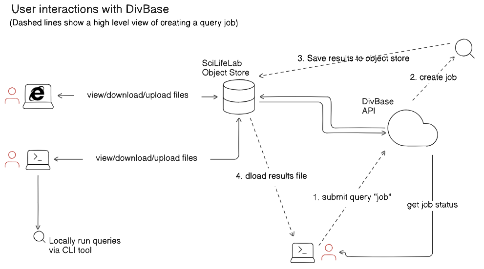
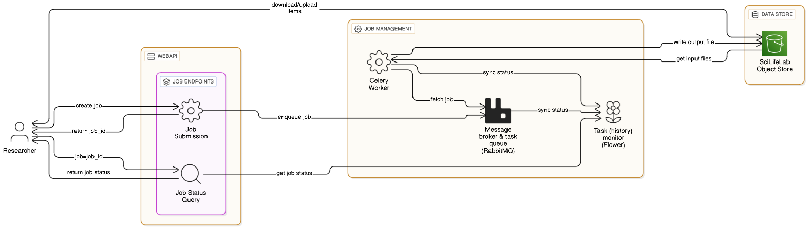

# Initial Design of DivBase 

## Status

Proposed

## Context

Genetic diversity research, such as population genomics, relies on the analysis and management of large, complex genetic variation datasets, typically stored in VCF ([Variant Call Format](https://samtools.github.io/hts-specs/VCFv4.5.pdf)) files. As studies scale up, effective data management becomes increasingly challenging. This difficulty largely arises from the fragmented nature of research data, which is often scattered across research group members, external collaborators, and government agencies. VCF files and associated sample metadata are rarely stored together, and reliable backups are often lacking, which hinders data analysis and future reuse. Without centralized infrastructure for data storage, versioning, and querying, the risks of meta(data) loss, duplication, and limited accessibility increase significantly. To address these issues, DivBase (Genetic Diversity Database) was proposed by Andreas Wallberg, a researcher from Uppsala University, during the 2024 DSN-EB inventory of needs.

DivBase will be a platform designed for the secure, medium-term management of VCF files and associated sample metadata, offering versioning and basic querying capabilities for non-human genetic variation data. It will support standard file formats that are compatible with the European Variation Archive (EVA), the international repository for genetic variation data. By addressing key data management challenges, DivBase aims to facilitate collaboration, enhance accessibility, and streamline the submission of data to long-term archives.

### Foreseen typical user journey in DivBase:

- A research group studying a species uploads their many VCF files, each several gigabytes (GB) in size, to the DivBase object store.
- The most common setup is: one species genome version = one project = one bucket. A new species genome version means a new bucket for that research group.
- The research group has a metadata file that contains contextual and biological information about the samples included in the VCF files. This file is uploaded to the bucket along with the VCFs.
- For follow-up analysis, researchers want to extract subsets of data from many files in the store. With the aid of the metadata file and the pre-existing executable tool [bcftools](https://samtools.github.io/bcftools/bcftools.html), they can operate on the files in the object store to produce a single, substantially smaller "results" file.
- DivBase will have a webAPI that can take a query from the researcher, process the query (can take from seconds to hours) and save the output of the query (results file) to the object store. This results file can then be downloaded by the user. These queries should be treated like jobs and users should be able to find out the status of their jobs whenever. 
- The above bullets are iterated over during the research study, until the day the project ends and the study is published. At this point, the data stored in DivBase should be uploaded to a domain-specific end-repository for data sharing. DivBase should preferably conform to the metadata standard of the key end-repository to facilitate the data publication.  

  
   
  <em>Fig. 1. Diagram showing how a user would interact with DivBase via a CLI tool, or via a web browser.</em>

### Core components
- S3 Object store with access control. 
- CLI tool to interact with the DivBase service. This will provide convenient ways to run queries on the files as well as interact with the files directly (e.g. upload/download). 
- WebAPI to accept query “jobs” and provide info about the status of each job. A user can use either the CLI tool or directly send requests to the API.  
- WebAPI talks to some kind of job management system that queues, runs and reports on the status of the jobs. 
- Software for prototype the query jobs. The query logic should be able to take the sample metadata file into account.
- Handling of metadata files. This includes user submitted sample metadata, but also system-generated metadata such as tracking bucket versioning states and indexing VCF dimensions for faster queries. 
- Frontend to manage users, projects, and download API keys. 

## Decision

This initial system design is intended to cover all the architectural components needed to enable users to perform - at a basic level - the workflow outlined in the [Foreseen typical user journey in DivBase](#foreseen-typical-user-journey-in-divbase) section above.

### Core Technology Stack

- **Orchestration:** [Kubernetes](https://kubernetes.io/) for production and deployed test instance. [Docker Compose](https://docs.docker.com/compose/) for local development (with an overlay for testing). We will use [kustomize](https://kustomize.io) to manage deploying to different enviroments due to prior in team experience with the technology. 
- **S3 object store:** In prod (and deployed test instance), this will be KTH NetApp. For local dev/tests, a MinIO image. 
- **WebAPI**: [FastAPI](https://fastapi.tiangolo.com/) with Postgresql as database (db). There will be a small frontend using Jinja2 templating and HTMX if needed (see [adr/002-Basic-API-design.md](adr/002-Basic-API-design.md) for more details). 
- **Job management system:** Consisting of [Celery](https://docs.celeryq.dev) worker(s); [RabbitMQ](https://www.rabbitmq.com/) queue/message broker; [Redis](https://redis.io/open-source/) results backend. Interaction with job management system using [Flower API](https://flower.readthedocs.io/en/latest/). 
- **Jobs logic:** [Pandas](https://pandas.pydata.org/) for queries on sample metadata files (e.g. subsets and filters).  [bcftools](https://samtools.github.io/bcftools/howtos/index.html) for working on VCF files.
- **Metadata files:** Initial prototype will be done with flat files such as TSV and YAML. A more robust solution is possibly needed to handle I/O concurrency resulting from being a multi-user service with an asynchronous job system. There will be sample metadata files that describe the samples contained in the VCF files. There will also be a technical metadata for the VCF files files to facilitate logic decisions and ensure robustness; please see [ADR-003](003-concurrency-strategy.md) for more details on this file.
- **Testing:** [pytest](https://docs.pytest.org/en/stable/). For frontend e2e tests, Playwright would likely be used.
- **CLI tool (for users to interact with service)**: [Typer](https://typer.tiangolo.com/). Built as separate uv/pip installable package. 

  
   
  <em>Fig. 2. DivBase architecture diagram. The user can use the CLI tool to interact with DivBase API. The webAPI is responsible for authentication/authorization and communicating with the job management system. Pre-signed URLs used to enable users access to project data stored in S3. Note that Redis and bcftools are not explicitly shown in the image: the former is part of the task history monitoring, the latter is part of the Celery workers.</em>

### System boundaries

The core functions of the DivBase is not public-facing but locked behind authentication/authorization. DivBase will require storage and compute, so the deployment on SciLifeLab hardware will - in line with scope the DDLS project - be limited to users that are affiliated with Swedish research institutions. Furthermore, DivBase is largely intended for use with unpublished data which also emphasizes the need for access control. Since auth is central to the service, it is likely a big architectural decision that will require its own ADR. 

DivBase is not a data publication platform. At the end of the research project, the users should submit their data and metadata to domain specific end-repositories for publication. This has implications for user roles, the lifespan of a given bucket, support/enforcement of metadata standards for key end-repositories (such as [EVA](https://www.ebi.ac.uk/eva/)). These should be covered in their own ADRs.

In line with the scope of the DDLS research area in Evolution and Biodiversity in which the team operates, DivBase will initially target research projects on non-model organisms. DivBase is not intended for use with sensitive data, such as human genetic variant data.

The investigations that have informed the current tech stack choices are primarily based on experiments in local dev environments using Docker Compose and toy datasets. We are yet to try the stack on the dev and production clusters, and can therefore not fully anticipate performance and implementation challenges on that hardware.

### Out of Scope: design choices that will be covered in separate ADRs

This ADR (001) is for the initial design of a DivBase prototype. More architectural design decisions will come, but will be handled in their own ADRs. Topics that are already foreseen include:

- [ADR-002: API-design](002-API-design.md) 

- [ADR-003: Concurrency stragedy](003-concurrency-strategy.md)

- Metadata schema

- Query syntax

### Why these choices

The guiding principle in choosing the proposed tech stack was to keep the service as lightweight as possible while allowing us to demonstrate proof-of-concept for its basic functionalities. We believe these choices meet the technological needs discussed above while also aligning with DC paved-path technologies whenever possible. 

For readers that are unfamiliar with working with VCF files, the importance of bcftools might not be immediately apparent from the core tech stack. However, its role as the core query engine in DivBase cannot be understated. Bcftools is a very popular tool with an established syntax. By writing wrapper logic around bcftools commands, the team will save a substantial amount of work compared to developing a custom VCF query engine. The intention is to use bcftools syntax as much as possible for DivBase to benefit from the fact that most researchers working with genetic diversity data are likely to have at least encountered bcftools, if not already be proficient users. 

## Alternatives considered

- **Using Django (or flask) instead of FastAPI:** see [002-API-design.md](002-API-design.md)

- **Kueue or SLURM instead of Celery**. Both the developers and the pilot user group have extensive experience using SLURM in HPC environment and envision a user experience similar to that of SLURM (queue jobs, check status, position in queue, job logs stored for later inspection). While there are no paved-path entries for job management systems at DC, Celery is already in use at DC for SciLifeLab Serve. Unlike the listed alternatives, Celery is written in Python, which is the preferred programming language at DC. If we were to switch to Django as mentioned above, it could be beneficial that Celery has out-of-the-box support for Django. 

- **RabbitMQ also as a job system results backend instead of Redis**. While RabbitMQ is primarily designed to be a job system message broker, it is able to take on the role of job systems result backend as well. Doing so would result in one less component to maintain in the tech stack. However, Redis was chosen as a results backend for its performance, ability to store persistent logs, and its excellent integration with the Flower monitoring system.

- **The proof-of-concept demo for DivBase uses flat files to store sample and system metadata**. The asynchronous, concurrent job system, combined with the possibility of multiple users working simultaneously on the same files in the bucket, may pose challenges.

- **Polars instead of Pandas**. Pandas is a framework we in the team have experience with. The sample metadata files that Pandas will work on are expected to be small and therefore the potential performance improvement is not deemed to be enough to use a tool we have no experience with. This can be revisited if we observe bottlenecks due to pandas operations. 

- **Single S3 bucket shared between all projects** (instead of 1 project, 1 bucket) This was considered but deemed less ideal due to the added complexity of managing user access. We were able to get KTH IT support to batch make 10 different buckets publically avaialble in one go. This approach is expected to meet project needs for at least 1-2 years.

- **Proxy S3 requests through DivBase instead of pre-signed URLs** Due to the large size of VCF files (~GBs) that users may want to up/download, we do not want to proxy the files through DivBase. We are not able to create accounts for users on S3 directly (and that would make access control more awkard) so pre-signed URLs was deemed the best option

## Consequences

Adopting the proposed tech stack for developing the inital prototype for Divbase is foreseen to have the following consequences:

### Positive

- The proposed tech stack will ensure that the core functionalities of DivBase will be implementable and will, as such, be a major step towards what will eventually be the DivBase MVP.

- The choice of bcftools ensures that all standard VCF subsets and filtering operations are supported by DivBase. This means that the team can focus on developing logic for query functionalities not supported by bcftools. The two main features are to be able to run queries horizontally across multiple VCF files, and coupling queries to a sample metadata file. This will create more powerful query "pipelines", and will be a major selling point of DivBase.

- At the time of writing, two team members have research experience working with VCF files and bcftools, and thus have a good understanding of use-cases, specifications, and quirks with the data format and its applications in different research projects.

### Risks & Challenges

- **Team learning curve** The team members have experience with some of the components in tech stack, but most of them are new to the team. Basic implementation does not seem to be an issue, but it would be valuable if other staff at DC or SciLifeLab could provide advice on best practices and optimization at some point during the development. 

- **Creating a robust system that can handle concurrent operations**. The use of concurrent operations in a multi-user service means that files will need to be protected against data errors and corruption due to parallel I/O operations. This is not only a technical risk but also an information security risk. How will data integrity issues affect the system, the users, their collaborators, and the quality of the research project? This will need to specifically addressed during the development Jobs will likely need to keep track of file version ID from the S3 store to ensure that all operations happen on the file versions present in the bucket at the time of job start.

- **Performance and implementation challenges on the cluster hardware is currently an unknown** We have not yet been able to test how our proposed tech stack would handle large files/big queries. We are aware of the possibility that once we get access to the production hardware and can get an idea of query performance, there is a risk that we need to reconsider some tech choices. Once we have a deployed instance on the dev cluster we will aim to use [Locust](https://locust.io/) for load testing, given that Team Whale have experience with using it. 