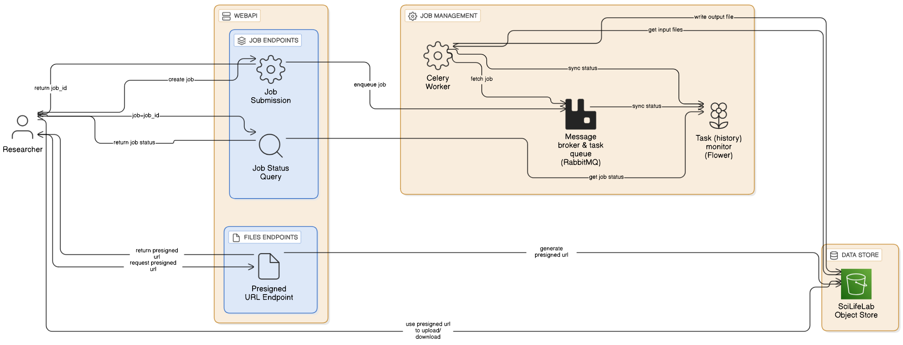

# Initial Design of DivBase 

## Status

Proposed

## Context

### DivBase project can be described as:

- A research group studying a species uploads their many files (GB) to the "DivBase" object store.
- 1 studied species = 1 project = 1 bucket. New species = new bucket for that project.
- The research group has a metadata file or metadata database that contains metadata about these files. 
- For follow up analysis, researchers want to extract parts from many files in the store. By using the metadata file and a pre-existing executable (bcftools), they can operate on the files in the object store to create a single (and much much smaller) "results" file.
- DivBase will have a webAPI that can take a query from the researcher, process the query (can take from seconds to hours) and save the output of the query (results file) to the object store. This results file can then be downloaded by the user. These queries should be treated like jobs and users should be able to find out the status of their jobs whenever. 

 

 
Diagram showing how a user would interact with DivBase via the web or via a CLI tool. 

### DivBase needs to contain these core components
- S3 Object store.
- CLI tool to interact with the DivBase service. This will provide convienant ways to run queries on the files as well as interact with the files directly (e.g. upload/download). 
- WebAPI to accept query “jobs” and provide info about the status of each job. A user can use either the CLI tool or directly send requests to the API.  
- WebAPI talks to some kind of job management system that queues, runs and reports on the status of the jobs.
- Frontend (not a priority), to manage projects/download API keys. 

## Decision

**The initial Implementation of DivBase is proposed to be:**
- S3 object store used for testing will be based on MinIO. In prod, this will likely be KTH S3 store ([see sysadmin issue](https://github.com/ScilifelabDataCentre/sysadmin/issues/501)).  
- CLI tool built with [Typer](https://typer.tiangolo.com/).
- WebAPI built with [FastAPI](https://fastapi.tiangolo.com/).  
- WebAPI talks to job management system made up of [celery](https://docs.celeryq.dev) and [rabbitmq](https://www.rabbitmq.com/).  
- Interaction with job management system using [flower API](https://flower.readthedocs.io/en/latest/). 

 

 

With this approach the user can use the CLI tool to interact with either their projects S3 bucket (upload/download files) or create queries via the webAPI. The webAPI is responsible for auth and communicating with the job management system on the users behalf.

## Alternatives considered

- **Using Django (/flask) instead of FastAPI:** Not arguing one is better than the other. Due to the low priority of having a frontend and that the frontend is expected to be quite limited, we have decided to try out FastAPI initially. The admin panel that comes with Django would be one benefit of using Django instead (make viewing users/projects easier).   

## Consequences

TODO. 