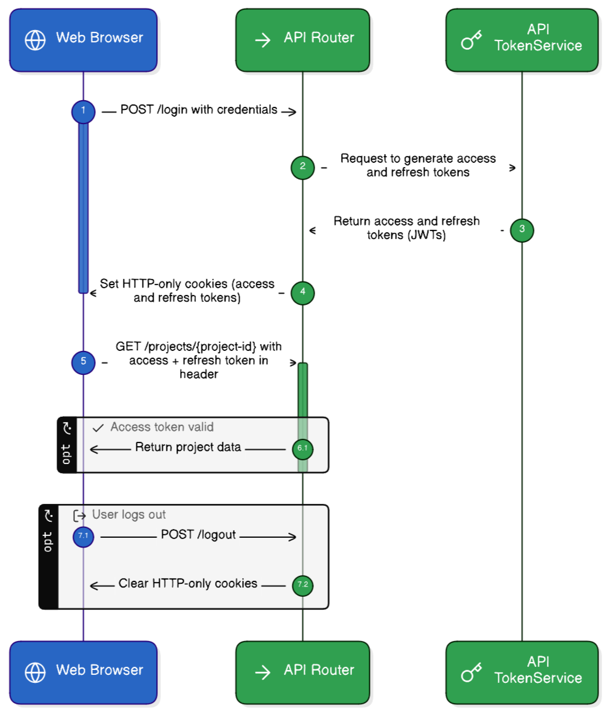
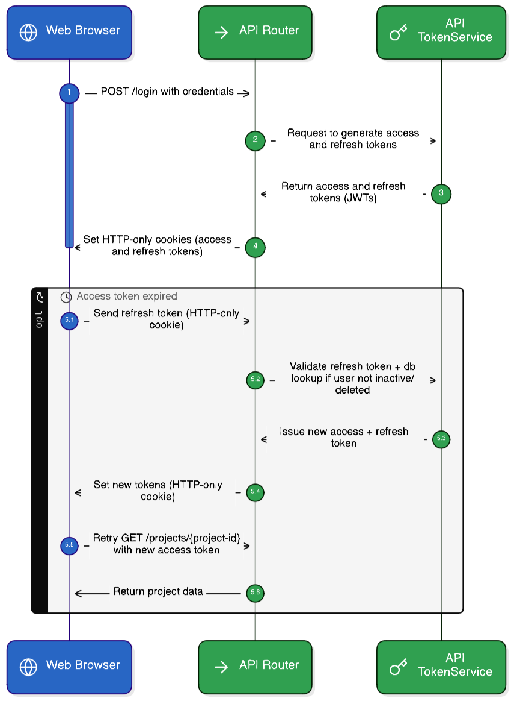

# 1. ADR 002: Initial Design of DivBase API

## 2. Status
Proposed

## 3. Context
DivBase API needs to handle all user interactions with the system:
- User and project management.  
- Facilitate upload/download of data files to S3 (users will not have accounts with S3).
- Run queries on the datasets and associated metadata "results files".

**Considerations:**
- The API must support both web-based and CLI-based workflows.
- Users will interact with the object store indirectly via pre-signed URLs generated by the API.
- We are making a CLI tool which handles interacting with the API. Whilst users could use the API directly, we are not optimizing/aiming for that.  
- The API will send a lot of network requests (to/from: user, job management system and S3) so an asynchronous implementation would be ideal.


## 4. Decision
Implemented using FastAPI, with PostgreSQL for the db. The API will handle all user interactions, including:
- Authentication and authorization using JSON Web Tokens (JWT).
- File upload/download operations via pre-signed URLs.
- Job submission and status tracking.
- The API will also provide a basic web interface for user and project management. These endpoints will return [HTMLResponses](https://fastapi.tiangolo.com/advanced/custom-response/#htmlresponse) using Jinja2 templating. HTMX used where/if needed. 

### 4.1 Web/API Endpoints
The following endpoints will be implemented:

FRONTEND_URLs:
```bash
{register, login, logout, reset_password}/
project/{proj_id} Basic overview, see projects, manage members if project manager
users/: Edit name, email, change password etc...
```

API_URLs:
```bash
/api/v1/{login, logout}/
/api/v1/query/: Submit query or check the status of a query
/api/v1/files/: Create presigned URL for user for S3 upload/download
/api/v1/version/: Utility to version the state of all bucket files
```


### Auth Flows

Propose to use JSON Web Tokens (JWT) as well supported by FastAPI. Can reuse the same auth logic as much as possible for both the Frontend and API.  

<p align="center">
  
  <br>
  <em>Auth flow for a web browser interacting with DivBase API. (API Router and API Token Service are both part of the FastAPI app).</em>
</p>


<p align="center">
  
  <br>
  <em>Refresh token logic. Unlike the access token, the refresh token logic includes a db lookup to verify that the user is still active and not deleted.</em>
</p>


### CLI vs Web Browser Difference:

The web browser would store the tokens in HttpOnly Cookies. 
The CLI would store the access and refresh tokens on the users local PC, e.g.:

```bash
divbase-cli auth login ...
## tokens auto added to ~/.config/.divbase_cli/.env
divbase-cli query ... # Both tokens passed in HTTP request sent to the DivBase API. 
```

### Refresh Token Revocation 

For any of the following scenarios: {`logout`, `manual revoke` `password reset`, `account deactivation`, }. The users prior refresh tokens should not be usable and this will covered by a mixture of blacklisting with a `RevokedRefreshTokens` table (see table schema in following section) and db lookups when trying to use the refresh token.  

##### Flows:

- On logout/revoke: Insert `JTI` (JWT ID) into table
- On password reset: update Users table `last_password_change` value. 
- On account deactivation: update Users table with `is_active` = False,
- On manual revoke: Admin eithers adds entry to RevokedRefreshTokens (if possible) or sets Users `last_password_change` value to now.  
-  **On refresh request:**
1. Check if token JTI in RevokedRefreshTokens → reject if found
2. Fetch user from DB by user_id (from token)
3. Check user.is_active → reject if False
4. Check token.iat < user.last_password_change → reject if older
5. If all checks pass (including signature) → issue new tokens


##### Notes: 

- Access token revocation not implemented due to need to do a db lookup on every request and short token lifespan (15 mins). 
- User roles + projects not stored in JWT (only user id), so a role change does not require a token blacklist. 


### DB Models - defined with sqlalchemy 2
```bash
Base: # inherited by all other models
  UUID, created_at, updated_at

Users(Base): 
  name, email, hashed_password, is_admin, is_active, last_password_change(datetime), last_login(DateTime)

Projects (Base): 
    name, description, storage_quota, bucket_name, is_active

ProjectMembership(Base): # To handle many-to-many relationship between users and projects
    user_id, project_id, role*, joined_at, is_active
    # *role would be an enum: {READ, WRITE, MANAGE}

RevokedRefreshTokens(Base): # blacklisted refresh tokens 
    token_jti, user_id, revoked_at, revoked_reason, expires_at
```

**Why no Jobs Table?** Our current approach is that the DivBase API queries the FlowerAPI for the job status/details and passes that back to the user. (see diagram in [ADR-001](adr/imgs/001-initial-design.png))


## 5. Consequences
Positive:
- FastAPI provides native async support. 
- JWTs can be used by both browser and API (reduced complexity).  
- Pre-signed URLs mean only once place for user administration. 

Negative:
- JWTs being stateless means tokens are not by default invalidated if a user's account becomes inactive or logs out. To manage this we will perform [refresh token blacklisting described here](#refresh-token-revocation)

- Dependency on FlowerAPI for job management introduces potential latency.

## 6. Alternatives Considered:


##### 6.1 Django (DC Paved Path) vs FastAPI

**DC Paved Path:** Django is the default web framework.

**Decision:** Use FastAPI.

**Justification:**
- Async-first design for I/O-heavy workload (S3, Flower API, RabbitMQ)
- Minimal frontend (3-4 pages) doesn't justify Django complexity
- Team FastAPI experience reduces learning curve
- Simple DB schema (3-4 tables)

**Django-Ninja considered:** Still requires Django patterns, doesn't resolve async advantage.

**Mitigation:** Using starlette-admin for admin panel. Migration to Django feasible if needed (4-8 weeks).

**This deviation is documented per DC governance requirements.**

##### 6.2 Jobs Table: Instead of relying on the FlowerAPI to parse jobs statuses a Jobs table could be added to the database to track job submissions and statuses. This could provide more control over job management but requires potentially a substational amount of additional dev work. 

##### 6.3 Redis blacklist vs RevokedRefreshTokens PostgreSQL Table for blacklisting user refresh tokens. RevokedRefreshTokens PostgreSQL Table chosen as PostgreSQL already in stack/used by FastAPI and minimal performance impact (check only on refresh), simple to implement. Redis blacklist would add latency to every request.