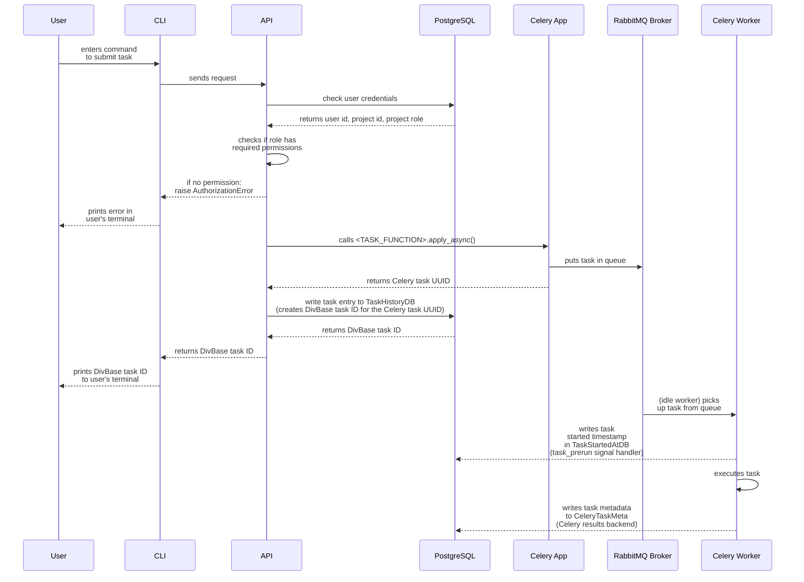

# Celery task implementation in DivBase

DivBase uses [Celery](https://docs.celeryq.dev/) as an asynchronous job management system. This document aims to describe how Celery tasks are implemented in the DivBase system architechture. The document can serve as a guide for maintaining and updating existing tasks, as well as implementing new tasks.

Tasks can be divided by how they are submitted to the queue: user-submitted tasks, and system-submitted periodic tasks. User-submitted tasks are manually enqueued in the job management system by entering a command on in the DivBase CLI. System-submitted periodic tasks are cronjobs that are enqueued based on a time schedule, and typically handle system maintenance tasks such as cleanup jobs.

## Table of Contents

- [1. Overview](#1-overview)
- [2. Implementation of user-submitted tasks](#2-implementation-of-user-submitted-tasks)
  - [2.1 Task Definition](#21-task-definition)
  - [2.2. Pydantic models](#22-pydantic-models)
  - [2.3. API endpoint](#23-api-endpoint)
  - [2.4. CLI](#24-cli)
  - [2.5. Task History deserialization](#25-task-history-deserialization)
  - [2.6. Admin Panel](#26-admin-panel)
- [3. Implementation of system-submitted periodic (cron) tasks](#3-implementation-of-system-submitted-periodic-cron-tasks)

## 1. Overview

Tasks are generally executed asynchronously and can possibly take a bit of time to run. This means that queing tasks and fetching task results are treated as two separate processes with their own CLI commands\*. For instance, a user might send a VCF file query task with the `divbase-cli query bcftools-pipe` CLI command; they can then run the `divbase-cli task-history user` command to learn the status of the job (queuing, started, sucess, failed) and any result or error messages. This document describes the steps needed to fully implement a task in Divbase, including  a CLI command to schedule the task, and the steps needed to make the task work with the task history command. Details on how the task history architechture works is not covered in this document.

\* One exception is `sample_metadata_query_task` that is assumed to run so quickly that it waits for results to be returned back to the user's terminal. The task is enqueued as an asynchronous celery task like any other task, with the difference that the API layer waits for the task layer to return the results so that the API in turn can return that to the users terminal.

DivBase uses a layered architechture and therefore task implementations occur at several layers. Roughly speaking, there is a Celery worker layer where the Celery app and its tasks are defined (including task metadata writes to database), an API layer that handles routing and some other required database operations, and a CLI layer that handles sending a task from the user's client to a specific API endpoint. The task signal flow in DivBase looks like the following, starting from the user input:

Figure 1: Sequence diagram of the task signal flow in DivBase. Note that this diagram only shows submission and execution of tasks; to fetch the result of a task, users need to use the task history CLI command, which is not included in this diagram.

## 2. Implementation of user-submitted tasks

### 2.1 Task Definition

- Tasks are defined in `./packages/divbase-api/src/divbase_api/worker/tasks.py`
- the file contain the celery app defintions, these should not be altered unless refactoring the celery app specifically
- a task is a function decorated with `@app.task(...)`.
- return a serializable dict (not a Pydantic model)!
- raise errors, not return in custom manner otherwise Celery will not set the Status of the task to FAILURE
- Optional: dynamtic task routing
- task input and outputs should preferrably be Pydantic models.

divbase tasks use kwargs. it is possible to use args, but the pattern is to not use it.

list which task kwargs are always needed

Celery signals (`after_task_publish`, `task_prerun`) will handle DB entries for task history and started_at automatically if you follow the patterns.

### 2.2. Pydantic models

In the folder in `./packages/divbase-lib/src/divbase_lib/api_schemas/`, add request models = task kwargs, response models = task results, and add those models to TaskHistoryResult to that they can be queried for by the user

Place request and results models in a relevant schema file (e.g., queries.py, vcf_dimensions.py).

### 2.3. API endpoint

- In `./packages/divbase-api/src/divbase_api/routes/`

- Add a FastAPI route to submit the task, validate input,
- enqueue the task function from tasks.py using `result = <TASK_FUNCTION>.apply_async`. This returns for instance the task UUID.
- call the `create_task_history_entry()` CRUD function to record the task UUID in TaskHistoryDB. This returns the DivBase task ID, which is the autoincrementing id from the postgreSQL table. this is an integer and much easier for the users to handle than long UUIDs.
- return the DivBase task ID

- Use the appropriate schema for request/response.
- user validation to return user id and project id

### 2.4. CLI

In the folder `./packages/divbase-cli/src/divbase_cli/cli_commands/`

- Add a CLI command to submit the task and/or fetch results.

### 2.5. Task History deserialization

- In `./packages/divbase-api/src/divbase_api/services/task_history.py`
- Update `_deserialize_celery_task_metadata` to handle your new task’s result and kwargs schemas.

### 2.6. Admin Panel

- In `./packages/divbase-api/src/divbase_api/admin_panel.py`
- If you want custom display/handling in the admin panel, update the relevant `ModelView`.

## 3. Implementation of system-submitted periodic (cron) tasks

Tasks that are scheduled by system.
