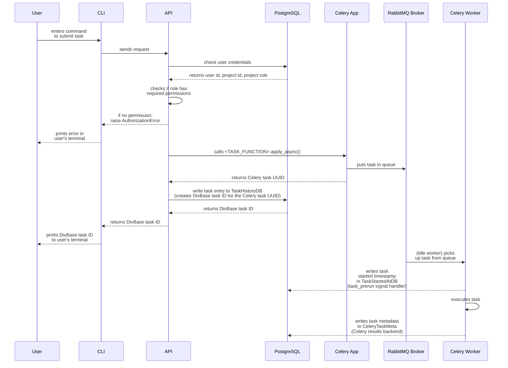

# Celery task implementation in DivBase

DivBase uses [Celery](https://docs.celeryq.dev/) as an asynchronous job management system. This document aims to describe how Celery tasks are implemented in the DivBase system architechture. The document can serve as a guide for maintaining and updating existing tasks, as well as implementing new tasks. It is intended to be a complement to the official Celery documentation, so please refer to them in addition to this.

As a rule-of-thumb, Celery tasks are intended to be used for operations that have a runtime that is longer than what is suitable for an asynchronous database transaction. In practice, operations that require interacting with files in an S3 bucket (including parsing the content of the files) should be run as a Celery task. If you want to implement a new function in DivBase that **only** relies on calling a CRUD function, it is better to do this directly in the API endpoint rather than enqueing a Celery task with the same logic.

Tasks can be divided by how they are submitted to the queue: user-submitted tasks, and system-submitted periodic tasks. User-submitted tasks are manually enqueued in the job management system by entering a command on in the DivBase CLI. System-submitted periodic tasks are cronjobs that are enqueued based on a time schedule, and typically handle system maintenance tasks such as cleanup jobs.

## Table of Contents

- [1. Overview](#1-overview)
- [2. Implementation of user-submitted tasks](#2-implementation-of-user-submitted-tasks)
  - [2.1 Task Definition](#21-task-definition)
  - [2.2. Pydantic models](#22-pydantic-models)
  - [2.3. API endpoint](#23-api-endpoint)
  - [2.4. CLI](#24-cli)
  - [2.5. Task History deserialization](#25-task-history-deserialization)
  - [2.6. Admin Panel](#26-admin-panel)
- [3. Implementation of system-submitted periodic (cron) tasks](#3-implementation-of-system-submitted-periodic-cron-tasks)

## 1. Overview

Tasks are generally executed asynchronously and can possibly take a bit of time to run. This means that queing tasks and fetching task results are treated as two separate processes with their own CLI commands\*. For instance, a user might send a VCF file query task with the `divbase-cli query bcftools-pipe` CLI command; they can then run the `divbase-cli task-history user` command to learn the status of the job (queuing, started, sucess, failed) and any result or error messages. This document describes the steps needed to fully implement a task in Divbase, including  a CLI command to schedule the task, and the steps needed to make the task work with the task history command. Details on how the task history architechture works is not covered in this document.

\* One exception is `sample_metadata_query_task` that is assumed to run so quickly that it waits for results to be returned back to the user's terminal. The task is enqueued as an asynchronous celery task like any other task, with the difference that the API layer waits for the task layer to return the results so that the API in turn can return that to the users terminal.

DivBase uses a layered architechture and therefore task implementations occur at several layers. Roughly speaking, there is a Celery worker layer where the Celery app and its tasks are defined (including task metadata writes to database), an API layer that handles routing and some other required database operations, and a CLI layer that handles sending a task from the user's client to a specific API endpoint. The typicall task signal flow in DivBase looks like the following, starting from the user input:



Figure 1: Sequence diagram of the task signal flow in DivBase. Note that this diagram only shows submission and execution of tasks; to fetch the result of a task, users need to use the task history CLI command, which is not included in this diagram.

## 2. Implementation of user-submitted tasks

For a user-submitted task to be fully integrated in DivBase, it needs to be implemented in six different layers, as described in the subsections below. Doing so ensures that the task can be enqued and executed in the job system, and ensures that the task results can be correctly returned to the user with the task history CLI command.

### 2.1 Task Definition

- Tasks are defined in `./packages/divbase-api/src/divbase_api/worker/tasks.py`
- Towards the top of the file are the Celery app defintions in `app = Celery()` and `app.conf.update()`. These should not be altered unless refactoring the celery app specifically. The Celery results backend handles writing of task metadata to the `CeleryTaskMeta` table in the postgreSQL database.
- Two Celery signal handlers are used to write to additional postgreSQL tables to capture values that are not included in `CeleryTaskMeta`. Like the Celery app, these should not be altered unless they are part of a refactoring.
  - The `after_task_publish` signal handler handles cron jobs specifically. This signal fires when a task is published to the queue. If the task name begins with `cron_task` an entry is written to `TaskHistoryDB`. For user-submitted tasks, the writes to `TaskHistoryDB` are handled by the API, as described below in Section 2.3.
  - The `task_prerun` signal handler fires when an idle worker picks up a task from the queue and changes its status to `STARTED`. This signal triggeres a write of a `started_at` timestamp to the `TaskStartedAtDB` table. This is used by the task history logic to calculate the runtime of a task.
- A user-submitted task in DivBase is a function decorated with `@app.task(tasks.<NAME>)`. It is possible to tag the tasks with labels, such as `tags=["slow"]`. These tags could potentially be used by other Celery logic, such as task routing, but the use of tags is optional in DivBase tasks.
- For clarity, suffix the function name with `_task`, e.g. `def <FUNCTION_NAME>_task()`. There is no logic that uses the suffix, so its function is to signal to the developer that this is a task function.
- Define the task arguments and their type hints just like any other Python function. There are no mandatory args for DivBase tasks, but there are some patterns that can be reused. For instance, if the task logic will interact with S3, add `bucket_name: str,` Tasks that interact with VCF dimensions table need `project_id: int,` for the `get_vcf_metadata_by_project()` helper function and `project_name: str,` for exceptions.
- The logic inside the task can be anything, but typically include reading file(s) from S3 and acting on them.
  - Divbase tasks can include database transaction (see next bullet below for more details), but if the task only does a database CRUD it would be better to implement that as an async database CRUD in the API layer rather than a Celery task since that is likely faster and does not require a Celery worker.
  - There are existing helper functions for S3 operations (e.g. `create_s3_file_manager()`, `_download_vcf_files()`, `_delete_job_files_from_worker()`) and VCF dimensions metadata table transactions (e.g. `get_vcf_metadata_by_project()`, `get_skipped_vcfs_by_project_worker()`,`create_or_update_vcf_metadata()`). Look at previous tasks to see if there are existing helper functions or logic that can be reused.
- Database transactions can be called from the task using the `SyncSessionLocal()` sessionmaker instance from SQLAlchemy. There is no point in trying to use async database sessions in DivBase Celery tasks since tasks are run in dedicated worker containers/pods and inside a Celery event pool (see the Celery docs for `prefork` pools). Furthermore, since Celery does not provide a simple way to use the async event loops from SQLAlchemy. Experiments during DivBase development showed that it is technically possible to implement workarounds to use async db sessions in tasks executed by Celery workers, but that it can easily result in event pool issues and errors.
- Raise errors in the task function (catching any errors proprageted from potential helper fuctions called by the task). This assures that `CeleryTaskMeta` is correctly updated with task status `FAILURE` and the error message. This assures that the task history CLI command correctly prints this information in the user's terminal. If errors are returned in any other way that with a `raise`, there is a risk that the status of the task becomes `SUCESS` even if it exited due to errors.
- Tasks end with a `return` statement. This is written to the `results` field in `CeleryTaskMeta`. Celery will use `pickle` to serialize the results for storage in the `CeleryTaskMeta` table.
  - For best compatibility, return a dictionary containing e.g. messages and values from the task.
  - Note! Celery cannot handle serialisation of Pydantic models so they cannot be directlty in the return. It is possible to have a helper function return a Pydantic model to the task, but then this needs to be dumped to Python dict with `<PYDANTIC_MODEL_NAME>.model_dump()`.
- Perhaps a little unintutive given the last subbullet above, but DivBase task input and outputs should preferrably be structured as Pydantic models since this gives benefits elsewhere in the codebase. Details on this is covered in Section 2.2.
- Dynamtic task routing is optional

Example of a task defintion:

```python
# This assumes that this is in tasks.py and that the celery app is defined somewhere above this example function

@app.task(name="tasks.example")
def example_task(
    my_input_parameter: str,
    bucket_name: str,
    project_id: int,
    project_name: str,
):

# To get the Celery Task UUID, for instance for logging and error messages, use:
task_id = example_task.request.id
logger.info(f"Starting bcftools_pipe_task with Celery, task ID: {task_id}")

# Example of how to add database transactions to a task by using the sync database session:
with SyncSessionLocal() as db:
    vcf_dimensions_data = get_vcf_metadata_by_project(project_id=project_id, db=db)

# Raise errors inside the task to ensure that the task is masked as FAILED in CeleryTaskMeta.
# Some custom exceptions exist that can take variables such as project name or task UUID
if not vcf_dimensions_data.get("vcf_files"):
    raise VCFDimensionsEntryMissingError(project_name=project_name)

# Add any logic that the task should perform,
calculated_value = my_function(my_input_parameter)

# The returns should preferrably be a dict (or a Pydantic model dump) to be compatible with Celery serilisation
return {"status": "completed", "calculated_value": calculated_value}
```

For a longer example, please look at `bcftools_pipe_task()` in `tasks.py`. The other examples in this document will refer to aspects of `bcftools_pipe_task()`, but for brevity, a toy task was used here instead.

### 2.2. Pydantic models

DivBase use Pydantic models for strong typing, type validation, and as self-documenting data structures. Support for Pydantic model validation comes out-of-the-box with fastAPI, which is the API service used in DivBase. As described in Section 2,1, the Celery task itself cannot return Pydantic models (this is a limiation of Celery). Other than that, Pydantic models are used for all requests and responses to/from the API, including when users submit tasks and request task history to/from the DivBase server.

In DivBase, Pydantic models are used together with Celery tasks in the following way:

- In the folder in `./packages/divbase-lib/src/divbase_lib/api_schemas/`, add a request model (send from the CLI to the API), a task kwargs model (send by the API to Celery), and a response model for the task results (used when returning task results with the task history CLI command).
- Also register those models in `TaskHistoryResult` Pydantic mdoel in `./packages/divbase-lib/src/divbase_lib/api_schemas/task_history.py` so that they are correctly returned to the user when the run the task history CLI command. Place request and results models in a relevant schema file within the api_schemas (e.g., `queries.py`, `vcf_dimensions.py`, or a new one with a name of your choice).

Example of a request, task kwargs, and results model for a task named BcftoolsQuery:

```python
class BcftoolsQueryRequest(BaseModel):
    """Request model for sample metadata query route."""

    tsv_filter: str
    metadata_tsv_name: str
    command: str


class BcftoolsQueryKwargs(BaseModel):
    """Keyword arguments for BCFtools query task. Used to pass info to Celery task, and also for recording task history."""

    tsv_filter: str
    command: str
    metadata_tsv_name: str
    bucket_name: str
    project_id: int
    project_name: str
    user_id: int


class BcftoolsQueryTaskResult(BaseModel):
    """BCFtools query task result details. Based on the return of tasks.bcftools_query."""

    output_file: str
    status: Optional[str] = None
```

And then add the task kwargs and task results models TaskHistoryResult in `./packages/divbase-lib/src/divbase_lib/api_schemas/task_history.py`:

```python
class TaskHistoryResult(BaseModel):
    """
    Task details as returned by queries to the SQAlchemy+pg results backend.
    """

    id: int
    submitter_email: Optional[str] = None
    status: Optional[str] = None
    result: Optional[
        Union[
            dict[
                str, Any
            ],  # Note! This dict must come first here so that error results are preserved and not incorrectly inserted into the result models
            SampleMetadataQueryTaskResult,
            BcftoolsQueryTaskResult, # Task result model from above example
            DimensionUpdateTaskResult,
        ]
    ] = None
    date_done: Optional[str] = None
    name: Optional[str] = None
    args: Optional[str] = None
    kwargs: Optional[
        Union[
            SampleMetadataQueryKwargs,
            BcftoolsQueryKwargs, # Task kwargs model from above example
            DimensionUpdateKwargs,
        ]
    ] = None
    worker: Optional[str] = None
    created_at: Optional[str] = None
    started_at: Optional[str] = None
    completed_at: Optional[str] = None
    runtime: Optional[float] = None
```

### 2.3. API endpoint

- API endpoints for enqueueing tasks are found in files the folder: `./packages/divbase-api/src/divbase_api/routes/`
- Endpoint functions are decorated on the form `@query_router.post("<ENDPOINT_URL>", status_code=status.HTTP_201_CREATED)`, where `<ENDPOINT_URL>` should be a RESTful URL such as `/bcftools-pipe/projects/{project_name}`
- To make use of fastAPIs async worker threads, define the function as`async def <ENDPOINT_FUNCTION_NAME>()`
- The endpoint function has several required arguments: the Pydantic Request model (see Section 2.2.) and three helper arguments / fastAPI dependency injections. The Pydantic model is used to convert the incoming payload into the model and validate its types (see Section 2.4 for how the CLI uses and serializes the same Pydantic model in the request).

 ```python
 async def my_endpoint_function(
    my_request_model: MyRequestModel,
    project_name: str,
    project_and_user_and_role: tuple[ProjectDB, UserDB, ProjectRoles] = Depends(get_project_member),
    db: AsyncSession = Depends(get_db),
 )
  ```

- The dependency injection in `project_and_user_and_role` and the helper function `has_required_role` are used to connect to the database and check that the user has permission to submit tasks to this project. See the example below for how to use it in an endpoint function.
- To enqueue the task function defined in `tasks.py` in the job system, use `result = <TASK_FUNCTION>.apply_async()`. This returns some initial Celery task metadata, including the Celery task UUID.
  - The established pattern in DivBase is - for clarity - to call `.apply_async()` with keyword arguments and not arguments. Specifically, the Pydantic kwargs model can be populated, and then dumped in to Python dict in `.apply_async()` since Celery cannot de/serialise Pydantic mdoels. This ensures that kwarg types are validated before enqueuing the task.
- Call the `create_task_history_entry()` CRUD function to record the Celery task UUID in `TaskHistoryDB` along with user and project ID. This function will return the DivBase task ID, which is the autoincrementing id from the postgreSQL table. This is an integer and much easier for the users to handle than long UUIDs.
- Finally, return the DivBase task ID to the user client as an API reponse.

Example of an API endpoint. This pattern can more or less be used as boilerplate code when creating new endpoints for user-submitted tasks.

```python
@query_router.post("/bcftools-pipe/projects/{project_name}", status_code=status.HTTP_201_CREATED)
async def create_bcftools_jobs(
    bcftools_query_request: BcftoolsQueryRequest,
    project_name: str,
    project_and_user_and_role: tuple[ProjectDB, UserDB, ProjectRoles] = Depends(get_project_member),
    db: AsyncSession = Depends(get_db),
) -> int:
    """
    Create a new bcftools query job for the specified project.
    """
    # Standard DivBase pattern to check if user has permission to submit a task to a specific project.
    # First calls a helper function that makes a lookup of user credentials in the database.
    # Assumes that the CLI sent the request using make_authenticated_request(), see Section 2.4.
    project, current_user, role = project_and_user_and_role
    # Then calls on another helper function to check if the credentials are enough to grant permission
    if not has_required_role(role, ProjectRoles.EDIT):
        raise AuthorizationError("You don't have permission to query this project.")

    # Pack the required task arguments in the corresponding Pydantic model (see Section 2.2.)
    # This ensures that the kwargs are type validated
    task_kwargs = BcftoolsQueryKwargs(
        tsv_filter=bcftools_query_request.tsv_filter,
        command=bcftools_query_request.command,
        metadata_tsv_name=bcftools_query_request.metadata_tsv_name,
        bucket_name=project.bucket_name,
        project_id=project.id,
        project_name=project.name,
    )

    # Send the task to the Celery app, which enqueues it in the job system broker.
    # Note that the kwargs Pydantic model is dumped already here. This is due to a limitation in Celery's deserialization. It may seem redundant, but this way the the kwarg types have been validated by Pydantic.
    results = bcftools_pipe_task.apply_async(kwargs=task_kwargs.model_dump())

    # Call a helper CRUD function to create an entry in TaskHistoryDB that maps Celery Task UUID,
    # User_id, and project_id. The auto-incremented table id is returned. This will now serve as
    # the DivBase task ID, since it it an int and less unwieldy than a full UUID.
    job_id = await create_task_history_entry(
        user_id=current_user.id,
        project_id=project.id,
        task_id=results.id,
        db=db,
    )

    # As a API response, return the DivBase task ID to the CLI client that made the request, where it can be displayed to the user.
    return job_id
```

Note on a special case: if a task returns is return result directly from the API endpoint (currently, only implemented in `sample_metadata_query_task()` since it is considered to be a very quick task), the endpoint decorator can contain the Pydantic results model (see Section 2.2.) as `response_model=SampleMetadataQueryTaskResult`. If used this way, fastAPI will validate the model before returning it, and raise an error if the returned data structure does not match the types of the Pydantic model.

```python
@query_router.post(
    "/sample-metadata/projects/{project_name}",
    status_code=status.HTTP_200_OK,
    response_model=SampleMetadataQueryTaskResult,
)
```

### 2.4. CLI

The DivBase client uses the [Typer](https://typer.tiangolo.com/) library to build its CLI. This part of the docs will not explain how the DivBase Typer architechture was setup, but will focus on adding a new CLI command to submit a task to the DivBase server.

- The CLI commands are defined in files in the folder `./packages/divbase-cli/src/divbase_cli/cli_commands/`. The CLI commands make requests to the API and gets responses back. For task-submitting requests, the CLI commands send task args to the corresponding API endpoint based on the user's CLI input.
- There needs to be a Typer app (on the form `query_app = typer.Typer()`) to which the CLI command functions needs to be connected. The app needs to be initiated with `app.add_typer(query_app, name="query")` in `./packages/divbase-cli/src/divbase_cli/divbase_cli.py`.
- The typer app name is used as a decorator for the function, e.g. `@query_app.command("bcftools-pipe")`. The argument of the decorator will become the command for the CLI.
- Pack the task arguments in the Pydantic request model (see Section 2.2), e.g. `request_data=BcftoolsQueryRequest()` for type validation.
- The `resolve_project()` helper function is be used to fetch the data from the users local config and is needed for the established pattern to make the request. This helper function need that the CLI function args contain `project: str | None = PROJECT_NAME_OPTION,` and `config_file: Path = CONFIG_FILE_OPTION,`. See an existing CLI file for more details on the constants they are calling.
- The main function call for all DivBase CLI->API interactions is `make_authenticated_request()`. If the user is logged in to the CLI, it sends the user's JSON Web Token as part of the request, which the API uses to validate the user's identity and project role/permissions.
  - The arguments `method="POST",divbase_base_url=project_config.divbase_url` should always be included as is.
  - `api_route` is the route URL defined in the corresponding endpoint (see Section 2.3).
  - `json=request_data.model_dump()` is used to serialise the Pydantic model to Python dict so that it can be passed as JSON in the request payload. The API endpoint will take this input and pack it back into the corresponding Pydantic model if everthing has been configured as described in Section 2.3.

Example:

```python

# Define a Typer app
query_app = typer.Typer(
    help="Run queries on the VCF files stored in the project's storage bucket. Queries are run on the DivBase API",
    no_args_is_help=True,
)


@query_app.command("bcftools-pipe")
def pipe_query(
    tsv_filter: str = typer.Option(None, help=TSV_FILTER_HELP_TEXT),
    command: str = BCFTOOLS_ARGUMENT,
    metadata_tsv_name: str = METADATA_TSV_ARGUMENT,
    project: str | None = PROJECT_NAME_OPTION,
    config_file: Path = CONFIG_FILE_OPTION,
) -> None:
    """
    Submit a query to run on the DivBase API. A single, merged VCF file will be added to the project's storage bucket on success.
    """
    # Helper function that fetches project information from the users local config file
    project_config = resolve_project(project_name=project, config_path=config_file)

    # Pack the required task arguments in the corresponding Pydantic model (see Section 2.2.)
    # This ensures that the kwargs are type validated
    request_data = BcftoolsQueryRequest(tsv_filter=tsv_filter, command=command, metadata_tsv_name=metadata_tsv_name)

    # Call an helper function to send a request to the API. If the user is logged in to the CLI,
    # the function passes a JWT token to the API that is used to verify the user's identity and permissions
    response = make_authenticated_request(
        method="POST",
        divbase_base_url=project_config.divbase_url,
        api_route=f"v1/query/bcftools-pipe/projects/{project_config.name}",
        json=request_data.model_dump(), # serialize the Pydantic model to Python dict since the API expects JSON. On the API side, it converted back to the Pydantic model.
    )

    # Using the pattern described in Section 2.3, the API returns the DivBase task ID, which can be displayed to the user in their terminal like such:
    task_id = response.json()
    print(f"Job submitted successfully with task id: {task_id}")
```

### 2.5. Task History deserialization

- In `./packages/divbase-api/src/divbase_api/services/task_history.py`
- Update `_deserialize_celery_task_metadata` to handle your new task’s result and kwargs schemas.

### 2.6. Admin Panel

- In `./packages/divbase-api/src/divbase_api/admin_panel.py`
- If you want custom display/handling in the admin panel, update the relevant `ModelView`.

## 3. Implementation of system-submitted periodic (cron) tasks

Tasks that are scheduled by system.
