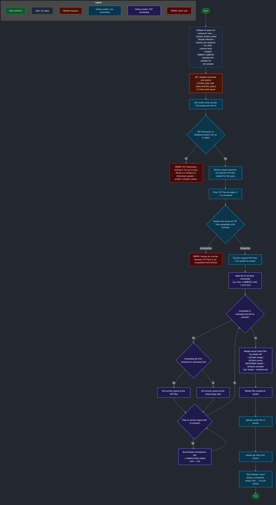
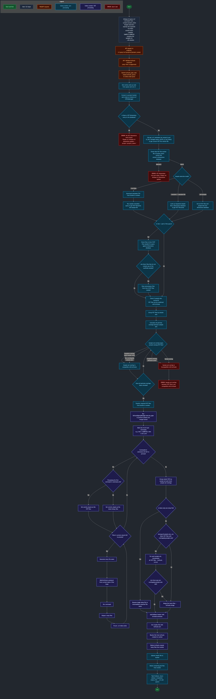

# Bcftools Celery Task Logic

User submitted queries to check out VCF data from DivBase are run as Celery tasks. This page given an overview of how the `bcftools` orchestration logic is designed for DivBase.

(See [Celery Task Implementation](celery_task_implementation.md) dev docs for the general task implementation.)

## Implementation

The task logic can roughly be divided in DivBase system operations, and `bcftools` operations.

The system operations are used to find which VCF files from the bucket to use in the query, check if they are compatible with the `bcftools` logic using the VCF dimensions data (see e.g. [Key Design Decisions Related to VCF files](key_design_decisions_related_to_vcf_files.md)) stored for the project in the PostgreSQL database, followed by download of the VCF files through [S3 transfers](s3_transfers.md) to the worker that will perform the `bcftools` operations.

The `bcftools` operations are designed so that each input VCF file is subset separately, intermediate results are saved to temp files, and, in the end, all temp files are combined to a single results file. See [VCF Query syntax section 5.3](../user-guides/vcf-query-syntax.md#53-how-does-divbase-process-the-vcf-files) of the user guide for a figure that illustrates this. The input files need to follow the constraints for `bcftools` in order to be successfully combined (summarised for the DivBase use case in [`bcftools` Celery Task Constraints](bcftools_task_constraints.md)). This is checked in the systems operations step before downloading the VCF files to the worker. If the check does not pass, the task exits early so that no resources are wasted on jobs that are known to not work.

In the subheadings below are flow charts that describe how the bcftools task logic is implemented in DivBase. There are two versions: one describing a simplified version of the flow, and one describing the full flow.

!!! tip
    Right-click on the flow-charts and choose "Open image in a new tab" for a version of the images that can be zoomed-in.

## Diagram of Simplified bcftools Task Logic Flow

Figure 1: Flow chart describing the simplified signal flow of the bcftools Celery task.

## Diagram of Full bcftools Task Logic Flow

Figure 2: Flow chart describing the full signal flow of the bcftools Celery task.
