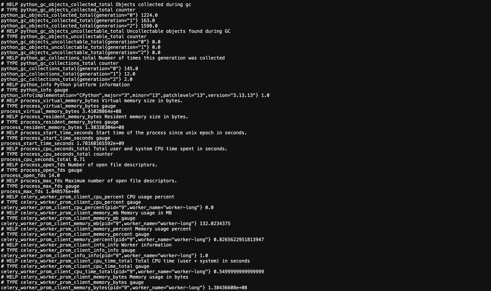
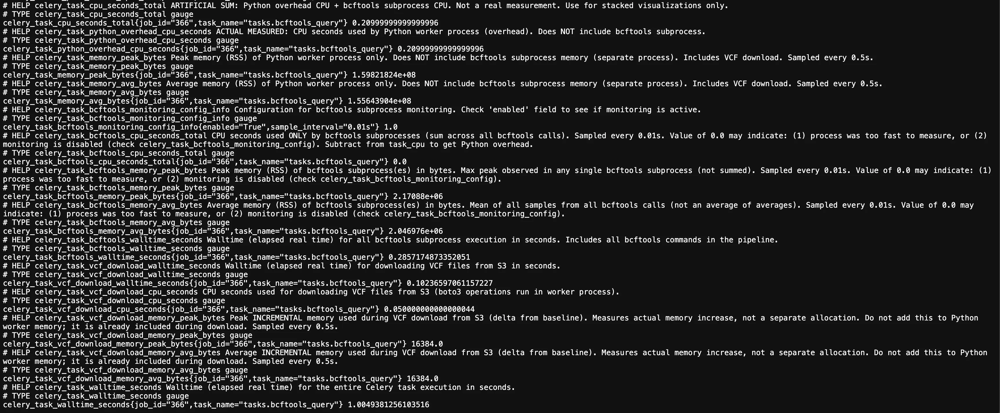

# Monitoring: Custom metrics collection for Celery worker

This document explains how resource usage metrics are tracked and reported for the Celery Workers in DivBase. Using a custom [`prometheus-client`](https://github.com/prometheus/client_python) metrics server, wall time, CPU time, and memory usage can be collected on a **per-task basis**. The metrics are collected with custom code written for DivBase, and this document collects the definition and rationale behind the units and calculations used to capture the metrics. Note that this document specifically describes the per-task metrics. It is possible to set up system/cluster wide resource monitoring in addition to this (e.g. `cAdvisor`, `node-exporter` etc.), but that is not covered in this page.

The per-task metrics system can be implemented for any task that runs in the DivBase Celery workers. However, this document was written specifically with the Celery tasks that call on `bcftools` in mind. These are the most resource intensive tasks in DivBase and include e.g. downloading of VCF files from the S3 object store to the Celery workers and running of `bcftools`.

!!! Note
    This page uses `pymdownx.arithmatex` for mathematical typesetting. We have noticed that there sometimes is a bug with the rendering of the maths section. If that happens, try reloading the webpage.

## 1. Metrics definitions

This section describes the metrics related to CPU and memory that are captured by the per task metrics system. Due to how computers and operating systems work, some of the metrics described below are additive, and some are not additive. This discrepancy can open up for mistakes in interpretation of these metrics. You are advised to think about the additive/non-additive distinction when reasoning about these metrics.

The subsections below will introduce the different processes that are monitored by the per-task metrics ([Section 1.1](#11-the-runtime-of-vcf-acting-tasks-can-be-divided-in-bcftools-processes-and-divbase-overhead-processes)), followed by the units wall time ([Section 1.2](#12-wall-time-total-time-elapsed-from-process-start-to-end)), CPU time ([Section 1.3](#13-cpu-time-additive-across-processes)), and memory usage ([Section 1.4](#14-memory-usage-not-additive-across-processes)).

### 1.1. The runtime of VCF acting tasks can be divided in `bcftools` processes and DivBase overhead processes

The per-task metrics system for the Celery workers was implemented in order to capture granular details about the resource demands of tasks that rely on `bcftools` to act on VCF files. At the time of writing, the per-task metrics has only been implemented for the VCF query task, and not the VCF dimensions update task although it also uses `bcftools`.

When measuring any resource metric for a DivBase task that acts on VCF files, it is relevant to distinguish between a) the time spent in the core VCF processing step (handled by `bcftools`), and b) the time spent in supporting operations (henceforth referred to as _the DivBase overhead_). The DivBase overhead steps include: downloading files from S3, making database lookups to the VCF dimensions cache, checking data compatibility against said dimensions cache, and running metadata queries (if included by the user in the task submission). Ideally, the DivBase overhead should be as small as possible, giving users a performance experience as similar as possible to that of just running `bcftools` on the files.

In DivBase in general, and the VCF query task in particular, operations outside of `bcftools` are typically implemented in Python. This means that it is quite straight-forward to measure the overhead by simply monitoring different aspects of the main Python process running in the Celery worker container that executes the query task. For `bcftools`, which does not have a Python API, this is instead handled by having the task spawn separate subprocesses whenever it needs to run `bcftools` operations (see [Section 1.3](#13-cpu-time-additive-across-processes) for details). These subprocesses set the lower bound for how fast a task that involved VCF processing can be: DivBase runs `bcftools` with certain parameters, but does not modify or optimize the `bcftools` source code.

### 1.2. Wall time: total time elapsed from process start to end

Wall time (also known as ["wall clock time", "real elapsed time", and other names](https://en.wikipedia.org/wiki/Elapsed_real_time)) is the total time elapsed from when a process started to when it ended. Wall time includes all time spent on CPU operations, I/O operations, and any periods of idle waiting. From a DivBase user's point-of-view, this is how long it took for a task to run from start to finish once it was picked up from the queue by an idle worker. The wall time value is especially relevant for the user experience, but does not give any detailed hints on what part of the underlying process(es) that can be optimized.

As will be discussed in the section on CPU time below, `bcftools` will be run in one or several subprocesses. Wall time is measured for the Python process and for the `bcftools` subprocesses with the `time` Python library. The wall time for the Python process is measured from the start to the finish of the Celery task (which is runs in the main Python process of the worker), and thus includes all subprocesses run during that time. This means that:

$$
\text{Total wall time for a DivBase task} = \text{Python process wall time}
$$

The wall time is also measured separately for the time it takes to run the `bcftools` calls of the task. Since the wall time for total task and the `bcftools` subprocess are measured, the DivBase task overhead can be calculated as:

$$
\text{DivBase overhead wall time} = \text{Python process wall time} - \sum_{i=1}^N \text{bcftools subprocess}_i \text{ wall time}
$$

To optimize (i.e. minimize) wall time, other metrics such as CPU time and memory usage need to be considered.

!!! Note
    The details covered in this document apply to any Celery task in DivBase. However, for tasks that do not call `bcftools`, the `bcftools` subprocess terms in the formulae here in [Section 1](#1-metrics-definitions) will be zero and thus the total task metrics will equal the Python process metrics alone.

### 1.3. CPU time: additive across processes

[CPU time](https://en.wikipedia.org/wiki/CPU_time) is the time that the CPU has been actively working on process. Compared to wall time, CPU time is always less or equal to wall time. A single-threaded process that executes without ever pausing or waiting will have a CPU time equal to its wall time; if the process is waiting for I/O or is idle, the CPU time will be less than the wall time.

CPU time is an additive metric: it is the total amount of time that the CPU spends on executing a process, including distribution across multiple CPU cores (if available). Furthermore, the tasks in DivBase that use `bcftools` need to spawn subprocesses since `bcftools` does not have a Python API and is run as a compiled C binary. Every time a `bcftools` command is needed during a DivBase task, the `subprocess` Python library is used to spawn a new process with a unique PID that consumes CPU time independently of the other processes. The Python process waits for each process to finish before continuing processing its own instructions, and as such the Python process can be seen as a master process for all the processes that are spawned and run during the task.

To capture the metrics, the `bcftools` subprocesses calls in the DivBase code use `subprocess.Popen` instead of the more commonly used `subprocess.run`: `Popen` starts the process and returns immediately with a live process handle, whereas `subprocess.run` blocks until the process exits. With the live handle, the monitoring loop can use `proc.poll()` (non-blocking; returns `None` while the process is running, an exit code when it finishes) to keep iterating while `psutil` samples CPU and memory on each iteration. Using `proc.wait()` or `subprocess.run` would block the Python thread until the process is done, making concurrent sampling impossible.

The monitoring code is set up to measure each task-related process individually: the Python process that runs the Celery task (including all operations that use Python libraries, such as `boto3` for interacting with the S3 object store), and the `bcftools` subprocesses. The latter is, at the time of writing, collected individually but stored as an accumulated total. The reason for this is that there is little room for optimization how `bcftools` runs during the individual subprocesses anyway, since the DivBase project does not alter `bcftools` source code.

Expressed in a formula, this means that:

$$
\text{Total CPU time for a DivBase task} = \text{Python process CPU time} + \sum_{i=1}^N \text{bcftools subprocess}_i \text{ CPU time}
$$

Because all DivBase-specific operations (such as file downloads, metadata checks, and orchestration) are performed in the main Python process, and bcftools subprocess CPU time is measured separately, the DivBase task overhead for CPU time is simply the CPU time of the Python process:

$$
\text{DivBase overhead CPU time} = \text{Python process CPU time}
$$

!!! Note
    Two things worth noting:

    1. CPU time is measured differently from wall time in DivBase. Wall time is measured from task start to finish, CPU time is measured per process.

    2. At the time of writing, the `bcftools` subprocesses in DivBase are implemented to be executed sequentially in a loop (for a diagram, see [Figure 1 in the VCF Query Syntax user guide](../user-guides/vcf-query-syntax.md#53-how-does-divbase-process-the-vcf-files)). They are NOT running in parallel. This means that CPU time accumulates across subprocesses that execute one after another. Each subprocess is currently single-threaded (since `bcftools` [docs](https://samtools.github.io/bcftools/howtos/scaling.html) mentions that "The --threads option is less useful than you think" and only is used for compressing input and output files).

### 1.4. Memory usage: not additive across processes

Memory usage monitoring in DivBase is based on measuring RSS (Resident Set Size). How Linux systems use memory is a much bigger topic than this document can cover, but in short, there is [RSS and VSZ (virtual memory)](https://stackoverflow.com/questions/7880784/what-is-rss-and-vsz-in-linux-memory-management). RSS is the memory allocation of a process in physical memory (RAM). Unlike CPU time, RSS memory usage is not additive across processes because operating systems allow processes to share memory regions, as for instance discussed in this forum [thread](https://stackoverflow.com/questions/131303/how-can-i-measure-the-actual-memory-usage-of-an-application-or-process) and in this [thread](https://unix.stackexchange.com/questions/34795/correctly-determining-memory-usage-in-linux). See also: [Kerrisk, M. (2010). The Linux programming interface: A Linux and UNIX system programming handbook. No Starch Press](https://www.man7.org/tlpi/). Whilst there are other tools and methods to monitor memory not covered here, RSS provides a decent estimate for the needs of DivBase resource optimisation.

Monitoring RSS memory usage is done per process. This means that for DivBase, the Python process that runs the task has its own memory usage, and each `bcftools` subprocess have their own memory usages. Note that although the Python process waits for the `bcftools` subprocess to finish, the memory used by the `bcftools` subprocesses is not reflected in the memory usage of the Python process during that time.

For DivBase, two memory metrics are calculated: Average memory usage (RSS, bytes) and Peak memory usage (RSS, bytes). The average is used to find the baseline RSS memory usage for the processes running during a task, and the peak is the highest RSS usage that was observed. These are used to set up the Kubernetes memory requests and limits, as described in the documentation in [private deployment repository](https://github.com/ScilifelabDataCentre/argocd-divbase). To collect this data, the RSS memory usage of the Python process and each `bcftools` subprocess is sampled at frequent intervals and stored in a data pool. The average and peak RSS is then calculated for each process based on these data pools. Note that total cumulative memory is not tracked since RSS is not additive.

## 2. Implementation details of the Celery worker metrics capture

The Celery workers can capture general container-level metrics, and per-task metrics. The Celery workers run as tasks with one task at a time (Celery prefork concurrency set to `1`). This means that a peak in CPU or memory will tell you that the worker was executing a task, but it will not be granular enough to tell you exactly what operation in the task that caused the peak. The per-task metrics was implemented as a way to increase the granularity and allow developers to write custom code to capture metrics from different aspects from the task. The downside of the per-task metrics is that it comes at an overhead in terms of running extra subsystems and added complexity of implementation.

The worker metrics capturing (general and per-task) is implemented in three layers that handle the following:

- **Exposing the Celery worker metrics with a `/metrics` endpoint**

    The worker runs the prometheus-client Python library that does two things: a) defines the metrics objects (gauges) that hold current values in memory, and b) starts a metrics endpoint. The endpoint is a lightweight server exposed on port 8101 (defined in  `start_http_server()` in `metrics.py`) that serialises the in-memory gauge values into Prometheus text upon requests to `/metrics`. This data is made available for Prometheus to scrape, and is cached for a limited time according to a Time-To-Live strategy as described [Section 2.2.](#22-scraping-and-persisting-of-the-metrics-data-with-prometheus).

- **"Persisting" the data with Prometheus scraping**

    To capture the exposed data from the metrics endpoint, a separate Prometheus service scrapes each worker's `/metrics` endpoint with GET requests at a frequent periodicity (every 15 seconds by default) and persists it (for a limited time) in Prometheus own time-series database. This is set up as a pull-based model: the scraper fetches the data through requests, which means that the Celery worker never pushes data. As will further discussed in [Section 2.2.](#22-scraping-and-persisting-of-the-metrics-data-with-prometheus), the `/metrics` endpoint TTL implementation is s a simple strategy that gets the job done, it has its drawbacks and could be refined. Also worth noting is that the Prometheus database has a default retention time of 15 days before eviction per datapoint.

- **Accessing the data from Prometheus time-series database**

    The data persisted in the Prometheus database can be fetched with Prometheus Query Language (PromQL) queries. This can be done in the in the Prometheus UI, programmatically through the Prometheus API, or through the custom Grafana dashboards set up for DivBase. There is also a script developed for a historical benchmarking experiment to facilitate programmatical results fetching  at [`scripts/benchmarking/fetch_per_task_metrics_from_prometheus.py`](https://github.com/ScilifelabDataCentre/divbase/blob/main/scripts/benchmarking/fetch_per_task_metrics_from_prometheus.py).

### 2.1 The Celery workers and their `/metrics` endpoint

Each DivBase Celery worker container (`worker-quick` and `worker-long`) capture metrics independently. Both containers run the same image and start the `/metrics` server on port 8101 inside their container, but use their own network namespace and container hostname. After enabling the endpoint ([Section](#211-toggling-the-metrics-endpoint-and-per-task-metrics-capture)) and starting the stack, locally or on Kubernetes ([Section 3](#3-running-the-per-task-metrics)), the `/metrics` endpoint will be available for scraping by the DivBase Prometheus service. They can also be viewed in a web browser: for the local Docker compose stack, the endpoints can be inspected at <http://localhost:8101/metrics> for `worker-quick` and <http://localhost:8102/metrics> for `worker-long`.

!!! Warning

    In the case that there is one replica per container (in a local Docker Compose stack or in a Kubernetes deployment) there is one replica per network namespace, and thus Prometheus will be able to scrape them independently and accurately. If the container replicas are increased to >1, the scraped data might be inconsistent; for instance, a load-balancer might send the request from the scraper to different replicas each time, and thus the time series will be a mix-up of data from multiple sources.

#### 2.1.1. Toggling the metrics endpoint and per-task metrics capture

The worker metrics are implemented using the `prometheus-client` and `psutil` Python libraries. The code that controls the metrics endpoint is found in [`packages/divbase-api/src/divbase_api/worker/metrics.py`](https://github.com/ScilifelabDataCentre/divbase/blob/main/packages/divbase-api/src/divbase_api/worker/metrics.py). This file defines each metric as a Prometheus Gauge (i.e. a current value that is overwritten over time) as well as helper functions to collect and cache the metrics and start a metrics server.

The metrics are captured in the tasks themselves in [`packages/divbase-api/src/divbase_api/worker/tasks.py`](https://github.com/ScilifelabDataCentre/divbase/blob/main/packages/divbase-api/src/divbase_api/worker/tasks.py). Not all tasks have metrics capturing set up: at the time of writing, it is only `bcftools_pipe_task()`.

The `start_metrics_server(port=8101)` in `metrics.py` helper function runs the `start_http_server` command of `prometheus-client` to expose a lightweight server at port 8101. However, the metrics capture comes with a computational overhead and can thus be toggled by two environment variables that are toggled with the values `1` (enabled) and `0` (disabled):

Table 1. Overview of DivBase environment variables related to per-task metrics.

| Variable | Controls | Default |
|---|---|---|
| `ENABLE_WORKER_METRICS` | Whether the Prometheus metrics server starts (system-level metrics + the health-check endpoint). Note! There are separate considerations for Kubernetes deployment — see [the deployment repository](https://github.com/ScilifelabDataCentre/argocd-divbase). | `1` |
| `ENABLE_WORKER_METRICS_PER_TASK` | Whether per-task metrics (CPU, memory, wall time per Celery task) are collected and exposed. Disable to reduce per-task overhead without affecting system-level metrics or health checks. Requires `ENABLE_WORKER_METRICS=1`. | `1` |
| `TASK_METRICS_CACHE_TTL_MINUTES` | How long (minutes) a completed task's metrics remain in the in-memory cache before being purged. Prometheus must scrape the endpoint within this window to capture the data. See the cache description below. | `5` |

!!! Warning
    The combination `ENABLE_WORKER_METRICS=0` and `ENABLE_WORKER_METRICS_PER_TASK=1` raises a `ValueError` on worker startup.

When `ENABLE_WORKER_METRICS=1`, the metrics server also continuously exposes system-level metrics for the worker process itself, independent of any task execution. These are sampled approximately every 6 seconds (5 s sleep plus some overhead) in a background thread (`collect_system_metrics()` in `metrics.py`) and remain active regardless of `ENABLE_WORKER_METRICS_PER_TASK`. All system-level metrics are labeled by `worker_name` (container hostname) and `pid`.

#### 2.1.2. General container-level metrics for the workers

The general worker gauges are labeled by `worker_name` and `pid`. In the `/metrics` endpoint, the values are serialised by the `prometheus-client` to [Prometheus text](https://prometheus.io/docs/instrumenting/exposition_formats/) format. Example for the metric client CPU percent, where the current value for this gauge is 4.2 %:

```text
# HELP celery_worker_prom_client_cpu_percent CPU usage percent
# TYPE celery_worker_prom_client_cpu_percent gauge
celery_worker_prom_client_cpu_percent{pid="1",worker_name="worker-quick"} 4.2
```

Table 2 lists the gauges that are captured by the general worker metrics:

Table 2. Custom Prometheus gauges for general container-level for the workers, as exposed by the `/metrics` endpoint.

| Metric | What it measures |
|---|---|
| `celery_worker_prom_client_cpu_percent` | CPU utilisation of the worker process (%) |
| `celery_worker_prom_client_memory_bytes` | [RSS memory](#14-memory-usage-not-additive-across-processes) of the worker process in bytes |
| `celery_worker_prom_client_memory_mb` | [RSS memory](#14-memory-usage-not-additive-across-processes) in MB |
| `celery_worker_prom_client_memory_percent` | [RSS memory](#14-memory-usage-not-additive-across-processes) as a percentage of total system memory |
| `celery_worker_prom_client_cpu_time_total` | Cumulative [CPU time](#13-cpu-time-additive-across-processes) (user + system) in seconds |
| `celery_worker_prom_client_num_threads` | Number of threads in the worker process |
| `celery_worker_prom_client_open_fds` | Number of open file descriptors (a rising value can indicate a resource leak) — Unix only |

An `Info` metric `celery_worker_prom_client_info` additionally emits `worker_name` and `pid` as label values, which is useful for correlating metrics across containers in Grafana. All general metrics are sampled approximately every 6 seconds in the `collect_system_metrics()` background thread in `metrics.py`.



Figure 1. Example of the metrics endpoint for `worker-long` showing the general container metrics. This is what the `prometheus-client` exposes and what the Prometheus service will scrape. Note that this interface is intended for quick inspection only: extraction of the data should preferably be done from the Prometheus time-series database [Section 3.3.](#33-fetching-the-scraped-data-from-the-prometheus-database).

#### 2.1.3. Per-task metrics for the workers

All per-task gauges are labeled by `job_id` (the DivBase task ID, not Celery task UUID) and `task_name`. (At the time the per-task metrics were implemented, "job ID" referred to the DivBase task ID. That naming has since changed; see [Celery task implementation](celery_task_implementation.md) for current terminology. The Prometheus label `job_id` retains the legacy name.) For the VCF query task, the results for two VCF query tasks (e.g. task ID 42 and 43) could look like this (8.3 s and 12.1 s, respectively):

```text
celery_task_walltime_seconds{job_id="42", task_name="tasks.bcftools_query"} 8.3
celery_task_walltime_seconds{job_id="43", task_name="tasks.bcftools_query"} 12.1
```

A full list of the gauges defined for the VCF query task can be found in Table 3.

Table 3. Per-task Prometheus gauges (`celery_task_*` family) exposed by the `/metrics` endpoint for the VCF query task.

| Metric | Phase of the VCF query task | What it measures | Notes |
|---|---|---|---|
| `celery_task_walltime_seconds` | Full task | Elapsed real time for the entire Celery task, start to finish | |
| `celery_task_python_overhead_cpu_seconds` | Full task | CPU seconds consumed by the Python worker process | Actual measurement; use this for CPU analysis |
| `celery_task_cpu_seconds_total` | Full task | Python overhead CPU + bcftools CPU artificially summed | Not a real measurement — constructed for stacked visualisations only |
| `celery_task_memory_peak_bytes` | Full task | Peak RSS of the Python worker process (sampled every 0.5 s) | Includes memory used during VCF download; does not include bcftools subprocess memory |
| `celery_task_memory_avg_bytes` | Full task | Average RSS of the Python worker process (sampled every 0.5 s) | As above |
| `celery_task_vcf_download_walltime_seconds` | S3 download | Elapsed real time for the VCF file download from S3 | |
| `celery_task_vcf_download_cpu_seconds` | S3 download | CPU seconds for the S3 download (`boto3` runs in the Python worker process) | |
| `celery_task_vcf_download_memory_peak_bytes` | S3 download | Peak incremental RSS during download, measured as a delta from a pre-download baseline (sampled every 0.5 s) | Already included in the full-task memory gauges above; do not add |
| `celery_task_vcf_download_memory_avg_bytes` | S3 download | Average incremental RSS during download, as above (sampled every 0.5 s) | Already included in the full-task memory gauges above; do not add |
| `celery_task_bcftools_walltime_seconds` | bcftools | Elapsed real time for the entire bcftools pipeline invocation | Measured at the `execute_pipe()` level — not the sum of individual subprocess durations |
| `celery_task_bcftools_cpu_seconds_total` | bcftools | CPU seconds summed across all bcftools subprocess calls (sampled every 0.01 s) | A value of `0.0` may mean the process finished too fast to sample; check `celery_task_bcftools_monitoring_config` |
| `celery_task_bcftools_memory_peak_bytes` | bcftools | Highest peak RSS observed in any single bcftools subprocess (sampled every 0.01 s) | Not summed across subprocesses (RSS is non-additive); do not add to the full-task memory gauges |
| `celery_task_bcftools_memory_avg_bytes` | bcftools | Mean of all RSS samples pooled across all bcftools calls (sampled every 0.01 s) | Mean of all raw samples, not an average of per-subprocess averages |

An `Info` metric `celery_task_bcftools_monitoring_config` is published on worker startup and exposes whether bcftools subprocess monitoring is enabled and the sample interval. Check this first if any bcftools gauge reads `0.0`.

Wall time is collected using the `time` Python standard library. CPU time and RSS memory for the Python worker process are collected via `psutil.Process()` and for each bcftools subprocess, `psutil.Process(proc.pid)` is used with the PID returned by `subprocess.Popen`. The RSS sampling loop is implemented as the `MemoryMonitor` class in [`metrics.py`](https://github.com/ScilifelabDataCentre/divbase/blob/main/packages/divbase-api/src/divbase_api/worker/metrics.py), polling at 0.5 s for the Python process and 0.01 s for bcftools subprocesses. The `bcftools` per-subprocess monitoring loop is in `BcftoolsQueryManager.run_current_command` in [`services/vcf_queries.py`](https://github.com/ScilifelabDataCentre/divbase/blob/main/packages/divbase-api/src/divbase_api/services/vcf_queries.py). The VCF download memory gauges are incremental deltas from a baseline taken immediately before `_download_vcf_files()` is called in `tasks.py`; note that they are already captured within the full-task RSS trace and must not be added to `celery_task_memory_peak_bytes` or `celery_task_memory_avg_bytes`.



Figure 2. Example of the metrics endpoint for `worker-long` showing the per-task metrics. As mentioned in the caption for Figure 1, this is what the `prometheus-client` exposes and what the Prometheus service will scrape. Note that this interface is intended for quick inspection only: extraction of the data should preferably be done from the Prometheus time-series database [Section 3.3.](#33-fetching-the-scraped-data-from-the-prometheus-database).

### 2.2. Scraping and persisting of the metrics data with Prometheus

After a DivBase Celery task completes successfully, the per-task metrics are stored in an in-memory cache structured as a dictionary of dictionaries. This is done with the helper function `_record_task_metrics` in `packages/divbase-api/src/divbase_api/worker/tasks.py`, which calls `store_task_metric_in_cache()` to save each metric value along with a timestamp. The cached values are then used to update the respective Prometheus gauges via `update_prometheus_gauges_from_cache()` in `packages/divbase-api/src/divbase_api/worker/metrics.py`. The metrics are stored per task using the DivBase job ID (not the Celery task UUID!) and task name as labels. The metrics are exposed via the Prometheus metrics endpoint at `/metrics`.

!!! Warning
    At the time of writing, metrics are never written for failed tasks! The per-task metrics for the VCF query task only reach the relevant metrics codeblock if the return occurs as intended; when this is the case, Celery will mark the task status with SUCCESS.

The cache for per-task metrics is needed because metrics must persist after task completion and remain available for Prometheus to scrape, even when multiple tasks run concurrently. To balance accessible task metrics history against unnecessary memory growth, each task metric is timestamped and evicted based on a Time-To-Live (TTL) strategy. The TTL period is set with `TASK_METRICS_CACHE_TTL_MINUTES` and defaults to 5 minutes. If Prometheus is configured to scrape the endpoint every 15 seconds, this means it has approximately 20 scrape attempts to collect the data before the metric is purged from cache. The purge background thread wakes every 60 seconds, so actual eviction may lag up to 60 s beyond the configured TTL. At the time of writing, there is no logic to check if a metric data point has already been scraped, so if all 20 attempts are successful, there will be 20 duplicates stored in Prometheus; this is clearly something that should be refined in a refactoring, if the per-task metrics are to be used routinely in the future.

!!! Note
    The Prometheus scraping implementation is, at the time of writing, a proof-of-concept that has not been optimized for data point deduplication. In fact, each successful scrape will store one timestamped sample, and there is no logic in place for deduplicating this. For example, a gauge holding `8.3` for the full 5-minute metric TTL will produce ~20 duplicate samples of `8.3` in the Prometheus time-series database, each with a different "scraped-at" timestamp. When writing PromQL queries, use `last_over_time(metric[5m])` or query at a single point in time to retrieve one value per task rather than summing or averaging across all samples. Data retention in the timeseries database is 15 days (Docker Compose stack: Prometheus default; Kubernetes: explicitly set).

The metrics server is started once per worker and exposes an HTTP `/metrics` endpoint on port 8101 that can be scraped by Prometheus. For the local Docker Compose environment, the scraping is configured in `docker/prometheus.yml`. The server is started using a Celery signal (`@worker_process_init.connect`) in `packages/divbase-api/src/divbase_api/worker/tasks.py` that fires when a Celery worker process first starts.

!!! Warning
    Celery prefork concurrency must be set to `1` for per-task metrics to be correct — both in the local Docker Compose setup and in Kubernetes.  Setting concurrency>1 will not crash the worker, but per-task metrics will be incomplete: only the process that bound the `/metrics` endpoint reports data, so any task routed to another process produces no visible metrics in Prometheus.

    The reason setting `concurrency>1` does not crash the worker is the `_metrics_server_started` module-level flag in `metrics.py`. When a Celery prefork worker spawns multiple processes, each calls `start_metrics_server()` on startup. The first process to reach the call binds port 8101, sets the flag, and becomes the sole host of the `/metrics` endpoint. Any subsequent process catches the resulting `OSError` (errno 98, "Address already in use"), sets the flag on its own side, and continues running — but since forked processes each have their own copy of the in-memory gauges, metrics written by Process 2+ exist only in their own memory and are never served via the endpoint. Prometheus only ever sees the gauges held by Process 1, so any task that Celery routes to another process produces no visible metrics.

The Prometheus scrape targets in prometheus.yml are worker-quick:8101 and worker-long:8101 — resolved by Docker's internal DNS, so Prometheus reaches each container's own independent endpoint.

The host port mapping in `divbase_compose.yaml` (`8101:8101` for `worker-quick`, `8102:8101` for `worker-long`) exists only for direct inspection during development — Prometheus itself uses the internal Docker network and never reaches the host ports.

## 3. Running the per-task metrics

### 3.1. Local monitoring stack (Docker Compose)

Prometheus, Grafana, and cAdvisor run as a separate, optional Docker Compose stack defined in `docker/monitoring_compose.yaml`. Keeping monitoring in a separate stack means the core development stack (`docker/divbase_compose.yaml`) is not burdened with services only needed when actively inspecting metrics.

The two stacks are linked by an external Docker network named `divbase-observability`. The main stack's worker services (`worker-quick`, `worker-long`) are attached to this network, so Prometheus can reach their metrics endpoints by hostname. Because it is an external network it must be created once before starting either stack:

```bash
docker network create divbase-observability
```

With the network in place, start the main app stack as usual,

```bash
docker compose -f docker/monitoring_compose.yaml up"
```

and then start the monitoring stack separately:

```bash
docker compose -f docker/monitoring_compose.yaml up
```

Once both stacks are running, the following interfaces are accessible locally:

Table 4. List of services in the local Docker Compose monitoring stack.

| Service | URL | What it shows |
|---|---|---|
| Grafana | <http://localhost:3000> | Pre-provisioned dashboards for worker per-task metrics and RabbitMQ queue metrics |
| Prometheus | <http://localhost:9090> | Raw metrics browser and PromQL query interface |
| cAdvisor | <http://localhost:8080> | Container-level CPU and memory usage for all running containers |

Prometheus scrapes three targets, as defined in `docker/prometheus.yml`: the two Celery workers at `worker-quick:8101` and `worker-long:8101` (the per-task metrics endpoint described above), the RabbitMQ management plugin at `rabbitmq:15692` for queue metrics, and cAdvisor at `cadvisor:8080` for container-level resource usage. The global scrape interval is 15 seconds.

For the per-task metrics to appear in Prometheus and Grafana, both `ENABLE_WORKER_METRICS` and `ENABLE_WORKER_METRICS_PER_TASK` must be set to `1`. Note that `docker/divbase_compose.yaml` explicitly sets both to `0` to reduce overhead during normal development, so you will need to override them to `1` (e.g. via a `docker compose` override file or by editing `divbase_compose.yaml` locally) before starting the stack. See Table 1 above.

### 3.2. Deploying the monitoring stack on Kubernetes

For details on how to deploy the per-task metrics to the Kubernetes clusters, see separate documentation in [the private deployment repository](https://github.com/ScilifelabDataCentre/argocd-divbase).

### 3.3. Fetching the scraped data from the Prometheus database

Prometheus data is queried using [PromQL](https://prometheus.io/docs/prometheus/latest/querying/basics/), which can be used directly in the Grafana Explore panel or via the Prometheus HTTP API at `localhost:9090`. For bulk retrieval of per-task metrics across multiple job IDs, the helper script `scripts/benchmarking/fetch_per_task_metrics_from_prometheus.py` provides a more convenient interface: it accepts an input YAML file specifying the job IDs and the date on which each job ran (required because the `query_range` API endpoint needs a start and end time), and writes the results to a JSON file. The expected YAML format and full usage instructions are documented in the script's module-level docstring.
