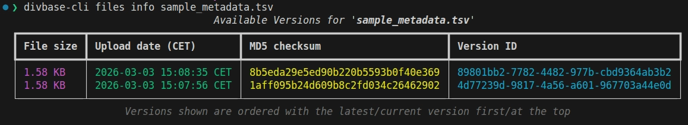

# Managing project files

The subcommand `divbase-cli files` provides you with a set of commands to interact with your project's file store.

!!! info "What is the project's file store?"
    - Each project in DivBase has its own separate, file store.
    - Files are versioned, so uploading a new file with the same name does not delete the existing file.
    - You can access and restore previous versions of a file at any time ([unless you hard deleted the file](#what-if-i-want-to-delete-a-file-permanently)).
    - When you view/download/stream files, you are always working with the latest version of that file by default, but you can also specify older versions if needed.
    - Every file uploaded to your project gets a unique `Version ID`. These IDs are used internally by DivBase to keep track of files and their versions, but you can also use them to access specific versions of files if needed

!!! info "Folders in your project's file store"
    - Your project's file store supports folders, allowing you to better organise your files.
    - When uploading, files are stored by their file name only (e.g. `divbase-cli files upload path/to/data/sample_metadata.tsv` becomes `sample_metadata.tsv`). Use the `--to` flag or the `--recursive` flag to preserve or create folder structure — see the [upload section](#uploading-files) for details.

## Quick links to each `divbase-cli files` subcommand

- [`ls`](#listing-files): List files and folders in your project
- [`tree`](#view-all-project-files-as-a-directory-tree): Display the file store as a directory tree
- [`info`](#getting-file-information): Get detailed info about a specific file (and every version of the file) in the project
- [`download`](#downloading-files): Download files
- [`download-all`](#downloading-all-files): Download all files in the project
- [`stream`](#streaming-files): Stream a file's content to standard out
- [`upload`](#uploading-files): Upload files
- [`mkdir`](#creating-directories): Create a directory
- [`rmdir`](#removing-directories): Remove an empty directory
- [`rm`](#deleting-files): Soft delete files
- [`restore`](#restoring-files): Restore soft deleted files

## How do I work with file versions?

This is perhaps easiest to understand with an example. Lets upload 2 different versions of the file `sample_metadata.tsv` to our default DivBase project:

```bash
divbase-cli files upload sample_metadata.tsv
# now edit the sample_metadata.tsv and upload it again
divbase-cli files upload sample_metadata.tsv
# we can see the versions stored in DivBase with the command:
divbase-cli files info sample_metadata.tsv
```



Here we see both versions of the file are still present in the project.

If you run any of the following commands, you will automatically use/see the latest version of the file. This is also true for any queries you submit to DivBase.

```bash
divbase-cli files ls
divbase-cli files tree
divbase-cli files download sample_metadata.tsv
divbase-cli files stream sample_metadata.tsv
```

If you want to download/stream a specific older version of a file, you can included the `Version ID` shown in the `info` command output like this:

```bash
divbase-cli files download "sample_metadata.tsv:VERSION_ID"
divbase-cli files stream "sample_metadata.tsv:VERSION_ID"
```

!!! info "You can't upload an identical file twice"
    If you try to upload a file with the same name and content as an existing file, DivBase will prevent this. This is done by first calculating the MD5 checksum of the local file your about to upload and comparing to the files in the project with the same name. This ensures that identical files are not uploaded multiple times.

    The MD5 checksum is also used to validate the upload process occurred without data loss.

## What if I want to delete a file permanently?

??? question "What is the difference between a "soft" and "hard" delete?"
    - A "soft delete" means the file is not actually deleted. The file is instead marked as deleted, and will no longer appear in the default file listings or be accessible through normal download/stream commands or be available in queries.

    - A hard delete is when the file is permanently deleted from DivBase and can no longer be accessed or restored.

A soft deleted file will still contribute to your projects storage quota as it is recoverable. Your storage usage can be seen on your projects page on the DivBase website.

A file will be hard deleted (not recoverable) if both of these conditions are met:

- The file has been soft deleted for more than 30 days. During this time period, [you can restore a soft deleted file](#restoring-files)
- The file is not [part of a project version](./project-versioning.md). If it is a part of the project version the project version would have to be deleted first.

## Details on each command

In this section, we provide more information on how to use each command related to working with files in your project.

!!! info "To get help and a full list of options for any command, you can always run:"

    ```bash
    divbase-cli files <command> --help # or -h
    ```

### Listing files

To see all the files and folders currently in your project's store, run:

```bash
divbase-cli files ls
```

This displays folders (highlighted in blue) followed by files. To also see file sizes and upload dates, use `--detailed` (or `-l`):

```bash
divbase-cli files ls -l # or --detailed
```

You can filter the listing by providing a prefix as a positional argument:

```bash
# List all files and folders whose name starts with 'sample'
divbase-cli files ls sample

# List the contents of the 'vcfs/' folder (include the trailing '/')
divbase-cli files ls vcfs/
```

!!! tip
    To browse the contents of a specific folder, include a trailing `/` in the prefix. For example, `divbase-cli files ls vcfs/` shows only what is inside `vcfs/`, with the folder prefix stripped from the output.

Other options:

- By default, files generated from DivBase queries are hidden. To include them, use `--include-results-files` (or `-r`).
- Use `--tsv` (or `-t`) to output the detailed view in TSV format.

### View all project files as a directory tree

To see all files in your project displayed as a directory tree, use the `tree` command:

```bash
divbase-cli files tree
```

You can scope the tree to a specific folder by passing its prefix as a positional argument:

```bash
divbase-cli files tree vcfs/
```

Other options:

- By default, DivBase query results files are hidden. To include them, use `--include-results-files` (or `-r`).

### Getting file information

To get detailed information about a specific file, including all its historical versions, use the `info` command:

```bash
divbase-cli files info my_file.vcf.gz
```

This will show you information about a specific version of the file that has been uploaded, along with its size, upload date, MD5 checksum, and a unique `Version ID`.

### Uploading files

You can upload files to your project's store using the `upload` command. Use spaces to separate file paths or use a glob pattern (e.g. `*.vcf.gz`) to specify multiple files. You can also provide a text file with a list of file paths (one per line) using the `--file-list` flag.

```bash
# Upload multiple files by specifying them one after another
divbase-cli files upload file1.vcf.gz path/to/file2.tsv

# Upload all .vcf.gz files in the current directory using a glob
divbase-cli files upload "*.vcf.gz"

# Upload all files in a directory using a glob
divbase-cli files upload "/path/to/data/*"

# Upload all files into a remote folder called 'experiment1/' using the --to flag
divbase-cli files upload "*.vcf.gz" --to experiment1/

# Upload all files in a directory and its subdirectories, preserving the subdirectory structure
divbase-cli files upload --recursive "/path/to/data/**"

# Upload recursively into a remote folder
divbase-cli files upload --recursive "/path/to/data/**" --to experiment1/

# Upload from a text file list (one file path per line)
divbase-cli files upload --file-list files_to_upload.txt
```

Use `--to` (or `-t`) to place uploaded files inside a remote folder. The folder does not need to exist beforehand — it will be created automatically. For example, `--to vcfs/batch1/` uploads all specified files into `vcfs/batch1/` in the project store.

When using `--recursive` with a `**` glob, the subdirectory structure relative to the glob root is preserved. For example, `divbase-cli files upload --recursive "data/**"` uploads `data/subdir/file.vcf.gz` as `subdir/file.vcf.gz`. Without a `**`, only the file name is used.

!!! warning "Safe Mode"
    By default, the `upload` command is performed in "safe mode". This mode calculates the MD5 checksum of your local files before uploading to:
    1.  Prevent re-uploading identical files that already exist in DivBase with the same name and content.
    2.  Verify data integrity by ensuring the checksum of the uploaded file on the server matches the local file's checksum.
    We strongly encourage you to keep safe mode enabled, but you can disable it with `--disable-safe-mode` if needed.

### Downloading files

You can specify which files to download using two methods:

```bash
# 1. space separated list of file names
divbase-cli files download file1.txt file2.csv --download-dir /path/to/save

# 2. from a text file with one file name per line
divbase-cli files download --file-list files_to_download.txt --download-dir /path/to/save
```

You can also download an entire folder by passing its name with a trailing `/`:

```bash
# Download all files inside the 'vcfs/' folder, preserving the folder structure locally
divbase-cli files download vcfs/ --download-dir /path/to/save
```

- If `--download-dir` is not specified, files will be downloaded to the default download directory set in your user config, or the current directory as a fallback.
- By default, any folder structure in the project store is preserved locally. Use `--flatten` (or `-f`) to download all files directly into the download directory, ignoring any folder paths.
- If you download a file that already exists in the target download directory, DivBase will overwrite the existing file.

#### Downloading specific file versions

By default, `download` fetches the latest version of a file. To download a specific older version, you need the file's `Version ID` (which you can get from `divbase-cli files info <file_name>`). Use the format `"file_name:version_id"`:

```bash
divbase-cli files download "my_file.vcf.gz:aBcDeFg12345"
```

You can download multiple files at once and mix and match between latest and specific versions in one command.

#### Downloading files from a project version

If you have created project versions (see [Managing Project Versions](./project-versioning.md)), you can download files as they existed at that point in time using the `--project-version` flag:

```bash
divbase-cli files download file1.txt file2.csv --project-version v1.0.0
```

This is avoids the need to figure out the specific version IDs for each file and is especially useful if you want to download a large number of files as they existed at a specific point in time.

### Downloading all files

To download all files in your project's store use the `download-all` command:

```bash
divbase-cli files download-all
```

This will download all current files in your project except for DivBase query results files. Before the download starts, you'll be prompted to confirm whether you want to proceed. The command will display the total number of files and their combined size.

!!! Info "Resume a download"
    Use the `--resume` flag to continue a `download-all` command that got interrupted.
    This will skip files already downloaded with the same file name and MD5 checksum.
    You need to use the same download directory (`--download-dir`) as your initial run.

Other flags:

- Specify the download directory with `--download-dir`.
- Use `--flatten` (or `-f`) to download all files into a single flat directory, ignoring any folder paths from the project store.
- Use `--dry-run` to see what would have been downloaded.
- Skip checksum validation with `--disable-verify-checksums` — strongly discouraged. Downloading the actual files takes much longer than this step too.

#### Downloading all files from a project version

As with the `files download` command, you can download all files as they existed at a specific project version:

```bash
divbase-cli files download-all --project-version v1.0.0
```

(This can be used in combination with the above flags too.)

### Streaming files

You can stream a file's content directly to your terminal's standard output without having to first download it. This is very useful for piping data into other command-line tools.

```bash
# View a file with 'less'
divbase-cli files stream sample_metadata.tsv | less

# View header of a VCF file
divbase-cli files stream my_file.vcf.gz | zcat | less

# Pipe a VCF directly into bcftools
divbase-cli files stream my_file.vcf.gz | bcftools view -h -
```

!!! info "Save and view a file simultaneously"
    You can also save a streamed content to a file while viewing using the unix `tee` command:

    ```bash
    divbase-cli files stream my_file.vcf.gz | tee sample_metadata.tsv | less
    ```

### Creating directories

To create one or more directories in your project store, use the `mkdir` command:

```bash
# Create a single directory
divbase-cli files mkdir vcfs/

# Create a single nested directory (parent directories do not need to exist beforehand)
divbase-cli files mkdir vcfs/batch1/metadata/

# Create multiple directories at once
divbase-cli files mkdir vcfs/ metadata/ results/
```

!!! info "Directories are created implicitly when uploading into them"
    Directories don't need to be created before uploading into them — uploading with `--to vcfs/` will create the folder automatically if it doesn't exist.

### Removing directories

To remove an empty directory from your project store, use the `rmdir` command:

```bash
divbase-cli files rmdir vcfs/
```

The directory must be empty before it can be removed. Use `divbase-cli files rm` to delete any files inside it first. If the directory does not exist, the command will exit without an error.

### Deleting files

To soft-delete files from your project's store, use the `rm` command:

```bash
divbase-cli files rm file1.txt file2.csv
```

- As with the upload and download commands, you can instead provide a list of files to delete with a text file using `--file-list` flag.
- Use `--dry-run` to see which files would be deleted without actually deleting them.
- Direct hard deleting of files is currently not supported, soft-deleted files are instead deleted after a certain time period, [see here for more details](#what-if-i-want-to-delete-a-file-permanently).

### Restoring files

If you have soft-deleted a file and want to restore it, use the `restore` command:

```bash
divbase-cli files restore file1.txt file2.csv
```

As with the other commands, you can provide a list of files to restore with a text file using `--file-list` flag.

To see which files are currently soft deleted and can be restored you can do:

```bash
divbase-cli files ls --show-deleted-files
```
