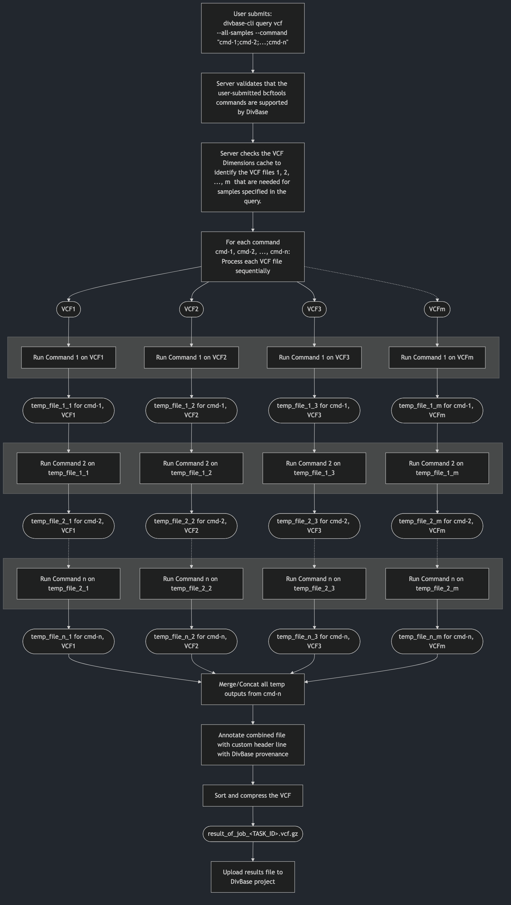

# DivBase VCF query syntax

Users can checkout subsets of their VCF data from their DivBase project using the command

```bash
divbase-cli query vcf
```

This data checkout is run as an asynchronous job that is sent to the queue on the DivBase server, and eventually run once there are idle resources to process the job. Users will get a job ID when they submit their query to the task queue, and can view the status of the job with the `task-history` commands, such as:

```bash
divbase-cli task-history id <JOB_ID>
```

The processing of the VCF files on the DivBase server is done with [`bcftools`](https://github.com/samtools/bcftools). DivBase will detect the VCF files in the project's data store that are needed for the query; if more than one VCF file is needed, DivBase will ensure that the files are compatible with each other according to the requirements of `bcftools` and ensure that a single results file with the subset data is returned to the user by running `bcftools merge` and `bcftools concat` on the intermediate files as needed. The result is a single VCF file that is uploaded to the projects data store and named after the job ID.

Users can query the VCF data in their project with or without combining it with a [sample metadata query](docs/user-guides/sidecar-metadata.md).

Example of a VCF query that identifies the samples and VCF files to filter on in the project's datastore and then applies a subset based on genomic range:

```bash
divbase-cli query vcf --tsv-filter  "Area:North,West;Weight:>10" --command "view -r 21:15000000-25000000"

# This will return the job ID of the submitted job. Example:
# Job submitted successfully with task id: 123

# Job status can be viewed with e.g.
divbase-cli task-history id 123

```

The outcome of a DivBase VCF query is a single results file with merged/concatenated data that fulfills all user-defined filters.

!!! Note
    When you submit a query, DivBase will use the state of the VCF Dimensions and the VCF files at that very point in time to produce the query results. It is therefore fine if you or another project member uploads new VCF files to the project while a query is queued or running.

## 1. Prerequisites

Ensure that the files of the DivBase project are prepared according to the instructions in [Running Queries Overview - Prerequisites](running-queries-overview.md#prerequisites). In short, this means that the [VCF files](vcf-files.md) and [sample metadata TSVs](sidecar-metadata.md) are formatted according to DivBase requirements and have been uploaded to the DivBase project's data storage, and that VCF dimensions cache is up-to-date. The latter can be ensured by running the following (and wait for the task to be completed) before submitting any VCF queries:

```bash
divbase-cli dimensions update
```

DivBase uses [`bcftools`](https://github.com/samtools/bcftools) to subset VCF data. The DivBase VCF query syntax is based on `bcftools view` as described in the [bcftools manual](https://samtools.github.io/bcftools/bcftools.html#view). If you are not familiar with `bcftools view`, you might want to take some time to study the different options. The commands used for DivBase VCF queries are described in more detail in the [Writing the bcftools command argument](#4-writing-the-bcftools-command-argument) section below.

## 2. `divbase-cli query vcf` command structure

```bash
divbase-cli query vcf \
  [--tsv-filter "<FILTER>"] \
  [--samples "<ID1,ID2,...>"] \
  [--samples-file path/to/samples.txt] \
  [--all-samples] \
  --command "<BCFTOOLS_VIEW_PIPE>" \
  [--metadata-tsv-name <FILENAME.tsv>] \
  [--project <PROJECT_NAME>]
```

- Required: `--command`
- Required: exactly one sample-selection mode (`--tsv-filter` OR `--samples` OR `--samples-file` OR `--all-samples`)
- Optional: `--metadata-tsv-name` (mainly needed with `--tsv-filter`)
- Optional: `--project` if user config default exists

The `--tsv-filter`, `--samples`, `--samples-file`, and `--all-samples` are mutually exclusive since they are alternative ways to control which samples to query on.

## 3. Sample and VCF file selection

To run a VCF data query, the user needs to input the samples to perform the query on, as well as the `bcftools view` command(s) (described in [Writing the bcftools command argument](#4-writing-the-bcftools-command-argument)) below. DivBase will use the VCF Dimensions cache to find the VCF files that these sample are found in, and process only those VCF files. The user thus never should input any VCF filenames in their queries.

DivBase supports different ways to input the samples. At least one of the following, mutually exclusive, sample-selecting options must be used in a VCF query:

`--tsv-filter`, `--samples`, `--samples-file`, or `--all-samples`

These are explained in the subsections below.

### 3.1. Metadata-driven sample and VCF file selection (--tsv-filter)

This is a combined sample metadata and VCF data query, that allows users to let the results of the metadata query (samples and VCF files) be automatically used for a VCF data query. The VCF queries in DivBase was designed with this in mind, since it augments regular `bcftools` subsetting with metadata-guides filtering.

The metadata query is input with `--tsv-filter` argument and uses the TSV format and filter syntax described in the guide on [sample metadata queries](sidecar-metadata.md). They system will by default look for `sample_metadata.tsv` in the project's data storage, but this can be overridden to use another TSV in the data storage using `--metadata-tsv-name <MY_SAMPLE_METADATA.TSV>`.

```bash
divbase-cli query vcf --tsv-filter  "Area:North,West;Weight:>10" --command "view -r 21:15000000-25000000"
```

For example, the system might find that the samples that fulfill the [sample metadata query](docs/user-guides/sidecar-metadata.md) set with `--tsv-filter` are, say, `S2`, `S5`, `S28`, `S108` and that they are described in the files `file1.vcf`, `file3.vcf`, `file4.vcf`. The DivBase server will then act on only these three files and subset based on the four samples.

!!! Tip
    Before using `--tsv-filter` in `query vcf`, you can do a dry-run of metadata query to ensure that the metadata query returns the expected samples and VCF files:

    ```bash
    divbase-cli query tsv "Area:North,West;Weight:>10"
    ```

### 3.2. Sample selection from direct input (--samples)

Users can also run VCF data query without metadata queries by defining which samples and/of VCF files to subset on. To get an overview of the VCF files and samples in the project, ensure that the [VCF dimensions cache is up-to-date](running-queries-overview.md#prerequisites) and run the following:

```bash
divbase-cli dimensions show
```

To just get all samples that are available for a project, use

```bash
divbase-cli dimensions show --unique-samples
```

To specify the samples on the command line, use the option `--samples`:

```bash
divbase-cli query vcf --samples "S1,S2,S10,S239" --command "view -r 21:15000000-25000000"
```

As long as the samples are present in the DivBase project, the server will automatically find out the VCF files it needs to process for the VCF query, by reading the VCF dimensions cache.

### 3.3. Sample selection from file (--samples-file)

An alternative to `--samples` for non-metadata driven VCF queries is to provide a plain UTF-8 text file with all sample IDs to use in the query. This is convenient when you have many samples. For example:

```bash
divbase-cli query vcf --samples-file samples_for_my_query.txt --command "view -r 21:15000000-25000000"
```

Format rules for `--samples-file`:

Allowed:

- One sample ID per non-empty line
- Blank lines (will be ignored)
- Comment lines starting with `#`

Not allowed:

- Multiple sample IDs on one line separated by delimiters such as `,`, `;`, tab, or `|`
- Header-like lines (for example `Sample_ID`) are not recommended and are treated as literal sample IDs unless the line starts with `#`

Valid example:

```text
# samples_for_my_query.txt
# this line is a comment
S1
S2

S10
S239
```

Invalid example:

```text
S1,S2,S3
S4;S5
```

If invalid delimiters are found, `divbase-cli` exits early with a format error before submitting the API request.

### 3.4. Explicit all-samples selection (--all-samples)

It is possible to use all samples in a DivBase project for a query, with some constraints. To select all samples, use the explict option `--all-samples`:

```bash
divbase-cli query vcf --all-samples --command "view -r 21:15000000-25000000"
```

To avoid accidental full-project runs, `--all-samples` requires at least one [supported](#42-bcftools-view-commands-not-supported-by-divbase) `bcftools view` option in `--command` other than `-s/--samples`. This is to avoid creating queries that take all samples and variant data from all VCF files in the project without subsetting them. For that case it would be more efficient to download the dataset from the project instead with:

```bash
divbase-cli files download-all.
```

and then merge them manually to a single file, or so desired.

## 4. Writing the bcftools command argument

Filtering and subsetting on the VCF data itself if done with the `--command` argument. It uses the syntax of `bcftools view` since that it is the computational tool that performs the VCF data processing on the DivBase server.

Several commands can be piped together by separating them by semicolons, similar to how UNIX pipes are commonly used to stream data between multiple bcftools commands.

Example of piped commands in DivBase VCF queries:

```bash
divbase-cli query vcf --samples "S1,S2" --command "view -r 21:15000000-25000000; view -g hom; view -i 'MAF>=0.05'"
```

The DivBase will apply the command(s) specified in `--command` in turn to a copy of each VCF file included in the query, and finally merge and/concatenate them in to a single results file. This means that the user should not state `merge` or `concat` in their commands.

!!! Note
    The [bcftools view manual](https://samtools.github.io/bcftools/bcftools.html#view) has the following recommendation:

    >Also note that one must be careful when sample subsetting and filtering is performed in a single command because the order of internal operations can influence the result. For example, the -i/-e filtering is performed before sample removal, but the -P filtering is performed after, and some are inherently ambiguous, for example allele counts can be taken from the INFO column when present but calculated on the fly when absent. Therefore it is strongly recommended to spell out the required order explicitly by separating such commands into two steps. (Make sure to use the -O u option when piping!)

    In DivBase, this would translate to separating several `view` commands with semicolons, e.g. `"view -r 21:15000000-25000000; view -g hom; view -i 'MAF>=0.05'"`

### 4.1. Automatic handling of samples and VCF file names

Samples and filenames are automatically handled by the DivBase server based on the user input discussed in [Sample and VCF file selection](#3-sample-and-vcf-file-selection) above. This means that users do no need to include `view -s` (sample selection option `-s`) at all. The same goes for the VCF filenames: the user should not include them at all since the system handles that for the user.

By default `view -s <SAMPLES_FROM_USER_OR_METADATA_QUERY` will be appended to the first command in the user-defined pipe. For example, a command like

```bash
divbase-cli query vcf --samples "S1,S2" --command "view -r 21:15000000-25000000"
```

Will be interpreted by the DivBase server to become:

```bash
bcftools view -s S1,S2 -r 21:15000000-25000000"
```

Users can override this to specify where in the pipe the sample subsetting should occur by explicitly including `view -s` in the `--command` string. This can be beneficial for the required runtime for certain pipes (see example use-cases in [How to create efficient DivBase queries](how-to-create-efficient-divbase-queries.md)). For example:

```bash
divbase-cli query vcf --samples "S1,S2" --command "view -r 21:15000000-25000000; view -s"
```

Will be interpreted by the DivBase server to a small script. It first applies `view -r` to each input file, stores the results in an intermediate file, then applies `view -s` to the intermediate files, stores the results to a new batch of intermediate files, and then finally merges/concatenates them into a single results file. The intermediate files are used instead of classic unix pipes (`|`) to allow for acting on mutliple VCF files seperatelly and combining them to a single results file. For more details on this, see [5.3. How does DivBase process the VCF files?](#53-how-does-divbase-process-the-vcf-files)

TODO: ensure that the backend only does `view -s` once. that actually goes for any commands. we should deduplicate identical commands.

TODO: ensure that the system handle the case where the user has included VCF filenames in their commands.

### 4.2. bcftools view commands not supported by DivBase

The `--command` argument will accept many, but not all possible `bcftools view` options. In short, commands that affect `bcftools` I/O settings, and filter input from file cannot be used with DivBase as the system handles this internally already.

The following `view` subcommands are not supported in DivBase:

<!-- markdownlint-disable MD056 -->
| `bcftools view` subcommand | Reason why it is not allowed in DivBase |
|---|---|
|-h, --header-only | Instead use: `divbase-cli files stream <file.vcf.gz> \| zcat \| awk '/^##/ \|\| /^#CHROM/ {print} !/^#/ {exit}'` |
|-l, --compression-level | Handled by the DivBase server|
|-O, --output-type | Handled by the DivBase server |
|-o, --output FILE | Handled by the DivBase server |
|-R, --regions-file file | External filter files not supported |
|-T, --targets-file file | External filter files not supported |
|--threads INT | Handled by the DivBase server |
|--verbosity INT | Handled by the DivBase server |
|-W[FMT], -W[=FMT], --write-index[=FMT] | Handled by the DivBase server |
|-S, --samples-file FILE | Covered by `divbase-cli query vcf --samples-file`|
|-f, --apply-filters LIST | Not supported in DivBase queries |
<!-- markdownlint-enable MD056 -->

The DivBase server will check if these are included in the `--command` string before the query job is sent to the job queue. If any of the unsupported `bvftools view` options are included in the string, the job will not be enqued and an error message will be returned to the user.

!!! Note
    Example of a `--command` with two DivBase-unsupported `bcftools view` options, and the resulting error message:

    ```bash

    divbase-cli query vcf --command "view -r chr2:1-10000; view -T; view -W"

    # Details: Unsupported bcftools view option(s) found in '--command':
    #  • Pipe segment 2, token '-T': Option '-T/--targets-file' is not supported in DivBase queries because external filter files are not supported.
    #  • Pipe segment 3, token '-W': Option '-W/--write-index' is handled by the DivBase server.
    ```

TODO the -s SAMPLES placeholder still lives on in the docs/docstrings

TODO perhaps the default place for `view -s` should be the last place of the command? since it is faster on shorter files?

TODO: ensure backend strips `-s LIST_OF_SAMPLES` to just `-s`
TODO: since we only support `view`, can there be a shortform where we skip `view` and just have the view flags?

## 5. What happens after submitting a VCF query? (Job lifecycle and outputs)

### 5.1. What the user can see after submitting the job

1. CLI returns `Job submitted successfully with task id: <ID>`
2. User monitors status via task-history commands `divbase-cli task-history`
3. On job success, DivBase uploads a result VCF file to project's data storage. If the job fails, user can read the error message in the task-history.
4. User can list/download result files from the project's data storage.

Suggested commands:

```bash
divbase-cli task-history id <TASK_ID>
divbase-cli files ls --project <PROJECT_NAME> --include-results-files
```

See also the manual for `bcftools view` [bcftools manual](https://samtools.github.io/bcftools/bcftools.html#view).

### 5.2. How VCF queries affect files in your project

- Source VCF files: uploaded by project members to the DivBase project. Read, but not modified by the query jobs. Source VCF files are indexed in the VCF dimensions cache of the project.
- Sidecar metadata TSV: read-only during queries.
- Result VCF files: new files created on successful jobs. Are never considered towards the VCF dimensions cache or subsequent VCF queries. Will be named `result_of_job_<JOB_ID>`. As an extra layer of provenence in case the file name of the results file is change, a the following is also added to the file header using `bcftools annotate`: `##DivBase_created="This is a results file created by a DivBase query; Date=<TIME_STAMP>"`

!!! Note
    - Re-running queries creates identical jobs and new result files. The system does not have any limitations for duplicate queries, so please be mindful of this.
    - Result files are outputs, not treated as new source data for future dimensions/indexing workflows
    - Keep bucket tidy by deleting obsolete result files if needed, they will take up space

TODO describe cron job for old results files

### 5.3. How does DivBase process the VCF files?

This section is aimed towards the technical user that would like to understand how DivBase uses `bcftools` to process VCF data queries on the files in a project's data storage.

Figure 1 below shows a schematic overview of how DivBase processes VCF queries for the general case of _n_ user-defined `bcftools view` commands in `--comands` and _m_ VCF files needed for the given query.



Figure 1. Schematic overview how the DivBase server will process _n_ `bcftools view` commands for samples that found in _m_ VCF files. The processing occurs in stages per command, meaning that each command _n_ is applied to each VCF file before moving on to the next stage where the next command _n+1_ is applied. Legend: Rounded shapes: VCF files; squares: process steps; gray boxes: stages of the command processing (each command is processed for all VCF files before processing to the next stage).

To give an example, let's say that this CLI command was submitted by a user to their project:

```bash
divbase-cli query vcf --samples "S1,S2" --command "view -r 21:15000000-25000000; view -s"
```

Let's assume that the server identified that two VCF files `file1.vcf.gz` and `file2.vcf.gz` are needed to query the two samples `S1` and `S2`. The DivBase server then interpret this information to dynamically create a small script, that in this case would look something like this:

```bash


# Process each input file with the first command:
bcftools view -r 21:15000000-25000000 file1.vcf.gz -Ou temp_1_1.bcf
bcftools view -r 21:15000000-25000000 file2.vcf.gz -Ou temp_1_2.bcf

# Process each temp file with the second command:
bcftools view -s S1,S2 temp_2_1.bcf -Ou temp_2_1.bcf
bcftools view -s S1,S2 temp_2_2.bcf -Ou temp_2_2.bcf

# Assume that the files have no overlapping sample sets, i.e. can be merged (this check happens before the job starts)
bcftools merge temp_2_1.bcf temp_2_2.bcf result_of_job_<JOB_ID>.vcf.gz
```

## 6. Examples

TODO add the following examples and ensure that they work with DivBase

- Region-only query across all samples
- Metadata + VCF combined query
- Direct sample list query
- Multi-step command with semicolon-separated pipeline stages

Each example should include:

- Command
- What it selects
- What output file behavior to expect

## 7. Common errors and how to fix them

TODO: Add a short table:

| Error | Likely cause| Suggested fix |
|---|---|---|
|TODO ADD CLI ERROR HERE | TODO ADD CAUSE| TODO ADD FIX |

- “Use only one of --tsv-filter, --samples, --samples-file, or --all-samples”
- Unknown sample IDs
- Empty/invalid `--samples-file` format
- Dimensions out of date
- Invalid filter syntax / unsupported command

See also:

- [Troubleshooting](troubleshooting.md)
- [VCF Dimensions](vcf-dimensions.md)
- [Sample metadata query](sidecar-metadata-queries.md)

## 8. Read next

- [How to create efficient DivBase queries](how-to-create-efficient-divbase-queries.md)
- [Tutorial: Running a query on a public dataset](tutorial-query-on-public-data.md)
